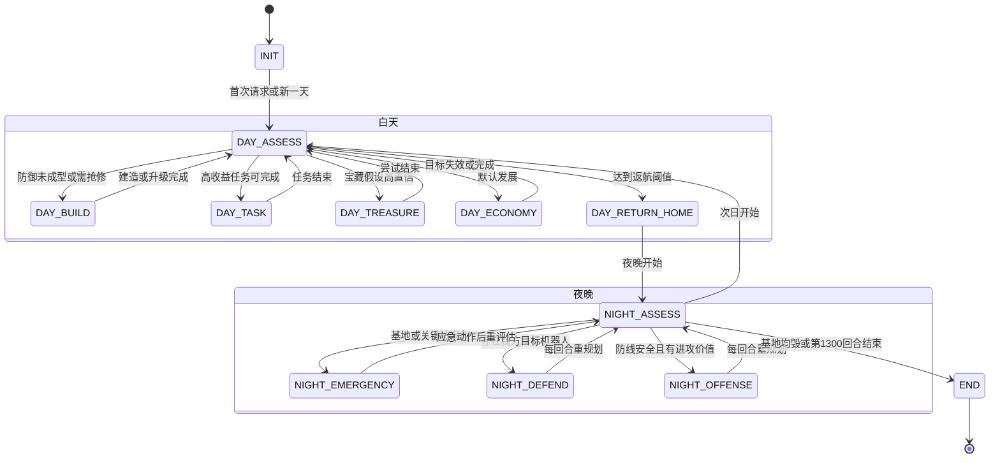
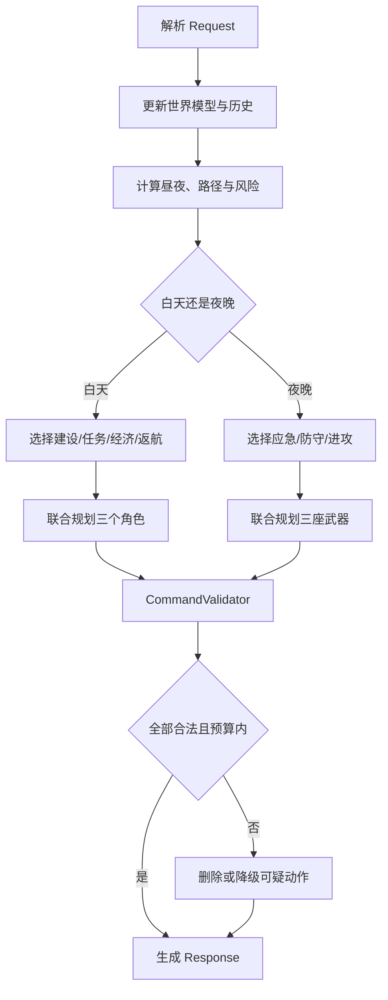
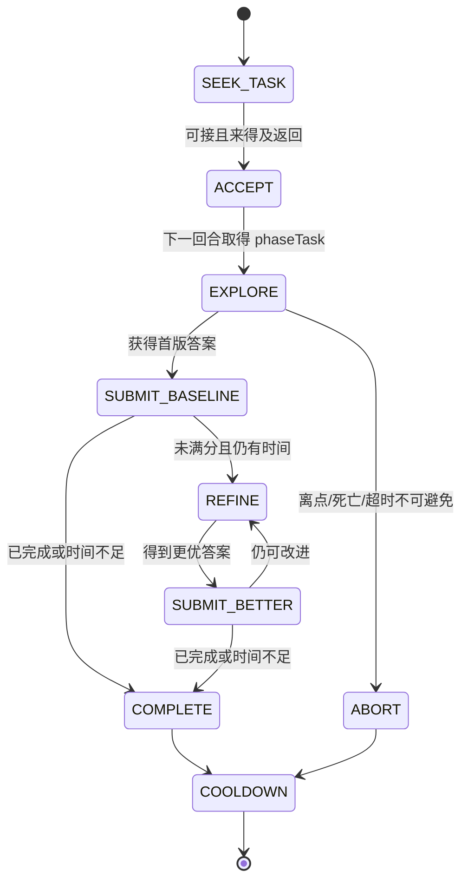
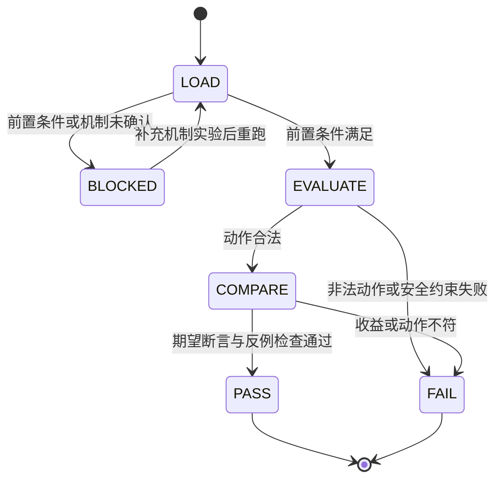

# 《未来战争》v1.0 作战策略

> 依据：《未来战争》v1.0 任务书、接口文档  
> 目标：在保证接口稳定和基地存活的前提下，最大化任务积分、机器人击杀分与经济转化效率。  
> 文档定位：策略设计与编码实现基线；所有阈值应配置化，并根据对局日志迭代。

## 1. 战略总纲

### 1.1 胜负优先级

每回合按以下顺序决策：

1. **响应合法**：绝不因字段缺失、动作码错误或超时消耗 5 次异常额度。
2. **避免基地先毁**：立即死亡风险高于积分和经济收益。
3. **保证夜间火力在线**：白天末尾让存活角色回到固定炮位。
4. **完成高收益任务**：尤其利用自进化任务的不限额 LLM 与沙盒能力。
5. **形成经济优势**：按单位回合收益采矿，结合新闻囤货和择时出售。
6. **获得击杀积分**：三座武器统一规划，减少重复伤害和伤害溢出。
7. **对敌施压**：仅在自身防御与应急资源充足后召唤机器人或执行 PvP。

核心纪律：

> 自己仍可能被打穿时，不用关键金币替对手制造可击杀的机器人。

### 1.2 硬约束

- 地图为 `41 × 32`，距离采用切比雪夫距离，角色可向 8 个方向移动。
- 每日白天 70 回合、夜晚 60 回合，共 10 天、最多 1300 回合。
- 每个角色每回合最多一个动作；一名角色只能控制一座武器。
- 全图最多三座武器；初始金币 75，单座武器 25。
- 武器不会自动攻击，角色须在武器一格范围内操控。
- 所有移动同时结算，须处理目标格争夺、位置互换和机器人碰撞。
- 下半场换边，所有路径、炮位和防御方向必须相对己方基地动态计算。

## 2. 积分权重与行动价值

### 2.1 胜负不是单纯的积分最大化

每半场应采用**分层目标**，不能把所有行动粗暴换算成同一种积分：

1. **第一层：避免先毁基地，并争取先摧毁敌方基地。**双方基地在不同回合被毁时，先毁者直接判负，已有积分不能弥补。
2. **第二层：双方大概率都能活到第 1300 回合时，最大化双方分差。**此时任务、生存和击杀积分共同决定胜负。
3. **第三层：在不明显降低前两层目标的条件下，积累金币、信息和可复用任务能力。**

因此，基地存在立即死亡风险时，即使一个任务或一组机器人能提供更多表面分数，也必须先保基地。建议用词典序目标实现，而不是只用一条加权和：

```text
maximize (P_not_die_first, P_kill_enemy_first, expectedScoreMargin)
```

仅在需要给候选动作排序时使用近似行动价值：

\[
V(a)=W_{win}\Delta P_{win}
+\Delta Score_{our}
-\lambda\Delta Score_{enemy}
+\mu\Delta FutureGold
-RiskCost
\]

其中 `W_win` 必须远大于单次任务或击杀分；当双方都安全时，才逐步降低 `W_win`、提高分差权重。

### 2.2 生存分：越到后期，单日权重越高

第 `d` 天存活的当日得分为 `10d`，累计活过第 `d` 天的生存分为：

\[
S(d)=10\sum_{i=1}^{d}i=5d(d+1)
\]

| 天数 | 当日生存分 | 累计生存分 | 若当天基地被毁，相对满程损失 |
|---:|---:|---:|---:|
| 1 | 10 | 10 | 550 |
| 2 | 20 | 30 | 540 |
| 3 | 30 | 60 | 520 |
| 4 | 40 | 100 | 490 |
| 5 | 50 | 150 | 450 |
| 6 | 60 | 210 | 400 |
| 7 | 70 | 280 | 340 |
| 8 | 80 | 360 | 270 |
| 9 | 90 | 450 | 190 |
| 10 | 100 | 550 | 100 |

表中“当天被毁”按任务书所述“被摧毁当天及之后存活系数为 0”计算。结论：

- 完整存活分上限为 **550 分/半场**，是稳定且规模很大的积分来源。
- Day 7 开始仍有 `70+80+90+100=340` 分待获取，后期不应为了小额击杀分冒基地风险。
- 防御投入不仅保护当日分，还保留后续任务、击杀和经济回合，其真实价值高于表中生存分。

### 2.3 任务分：高收益来自“尽快满分”，不是长期占点

完整完成任务：

\[
Score_{full}=R+5\times\frac{T}{t}
\]

部分完成任务：

\[
Score_{partial}=R\times p
\]

其中 `R=scoreReward`、`T=timeoutRounds`、`t=实际完成回合-接取回合`、`p=最好提交答案通过率`。

若 `T=30`，仅速度奖励如下：

| 完成用时 `t` | 速度奖励 `5T/t` | 等价小型机器人击杀数 |
|---:|---:|---:|
| 2 | 75 | 75 |
| 3 | 50 | 50 |
| 5 | 30 | 30 |
| 10 | 15 | 15 |
| 20 | 7.5 | 7.5 |
| 30 | 5 | 5 |

任务还有 `goldReward × 通过率` 的金币收益，会继续转化为生存与击杀能力。因此高价值任务应追求：

- 接取前准备好同类 SOP，减少领取后的分析回合；
- 取得 `phaseTask` 后同回合并行调用 LLM 与 `executeCmd`；
- 尽早提交首个有效答案，锁住部分完成收益；
- 若距满分很近，继续快速迭代；若改进概率低且占点将影响返航，立即止损。

任务优先级不只看 `scoreReward`，推荐比较单位角色回合的风险调整收益：

\[
TaskDensity=\frac{P_{full}(R+5T/t)+(1-P_{full})R\hat p+\mu G\hat p}
{travelRounds+taskRounds+returnRounds}
\]

### 2.4 击杀分：Middle 的分值密度最高，Large 最低

| 机器人 | HP | 击杀分 | 分/HP | 防守含义 |
|---|---:|---:|---:|---|
| Small | 40 | 1 | 0.0250 | 易击杀，适合补刀 |
| Middle | 60 | 2 | **0.0333** | 纯刷分效率最高 |
| Large | 500 | 4 | **0.0080** | 分低血厚，主要按威胁处理 |
| Boss | 800 | 10 | 0.0125 | 高威胁，适合眩晕后集火 |

当基地安全且只比较击杀分时，目标顺序倾向 `Middle > Small > Boss > Large`；当基地受威胁时，应按“预计阻止的己方伤害”排序，不能为刷 Middle 放任 Large/Boss 攻击基地。

三座武器的行动价值应拆成：

```text
保命收益 + 击杀分 + 保护炮台/墙的收益 - 过量伤害 - 冷却机会成本
```

### 2.5 召唤令：Large 的施压效率最好，且送分率最低

| 类型 | 价格 | HP | HP/金币 | 对手最高击杀分/金币 |
|---|---:|---:|---:|---:|
| Small | 20 | 40 | 2.0 | 0.0500 |
| Middle | 30 | 60 | 2.0 | **0.0667** |
| Large | 100 | 500 | **5.0** | **0.0400** |
| Boss | 200 | 800 | 4.0 | 0.0500 |

在不了解对手配置时，Large 同时具有最高 HP/金币和最低潜在送分率，是默认进攻首选。Middle 虽然便宜，但最容易向对手输送积分；只有确认对手缺少多目标与范围火力、且数量能造成漏怪时才批量召唤。

召唤的真实收益为：

\[
V_{summon}=\Delta P(enemyBaseDestroyed)\times W_{win}
+ExpectedDamageValue
-ExpectedEnemyKillScore
-GoldOpportunityCost
\]

若召唤不足以显著增加突破概率，就应把金币留给己方升级或应急物品。

### 2.6 金币的防御转换效率

仅按“满血时增加的最大 HP”计算，升级券的最低直接效率如下；受损后使用还会额外回满血，实际效率更高。

| 物品 | 价格 | 满血时新增最大 HP | 最低新增 HP/金币 | 额外价值 |
|---|---:|---:|---:|---|
| Station L1→L2 | 100 | 1500 | 15.0 | 延长整局生存 |
| Station L2→L3 | 150 | 1500 | 10.0 | 延长整局生存 |
| Wall L1→L2 | 20 | 500 | 25.0 | 关键承伤点强化 |
| Wall L2→L3 | 30 | 500 | 16.7 | 关键承伤点强化 |
| Weapon L1→L2 | 100 | 500 | 5.0 | 同时提升射程、火力与满血 |
| Weapon L2→L3 | 150 | 500 | 3.3 | 同时提升射程、火力与满血 |

`WallFixer` 的效率为“墙缺失 HP / 10”。例如 level 3 墙剩 100 HP 时，10 金币恢复 1900 HP，达到 190 HP/金币。由此得到：

- 防线已经能把机器人稳定导向一堵关键墙时，`WallFixer + 维修工` 的边际价值极高。
- 武器升级不能只按 HP 衡量；增加攻击目标、能量、射程可能带来持续多夜的击杀与减伤。
- `Bomb/DizzyWeapon` 各 100 金币，不适合只为少量击杀分购买；应在其能显著提升存活概率时使用。

### 2.7 每回合的积分决策门槛

按以下顺序评估候选动作：

1. **致死门槛**：不做该动作是否会使基地或关键炮台在未来 1～3 回合内被摧毁？若是，先应急。
2. **夜间就位门槛**：是否降低夜晚首回合三炮有人操控的概率？若是，除极高价值快速任务外拒绝。
3. **任务密度门槛**：任务的风险调整分/角色回合是否高于当前采矿、购物或建设行动？
4. **金币影子价格**：花费后是否仍能覆盖今晚的维修、应急物品和计划升级？
5. **相对分差门槛**：自己的得分收益是否同时给对手制造更高的击杀分或更安全的防线？

由于接口不直接提供敌方总积分，应维护 `estimatedEnemyScoreRange`：根据可见击杀、基地存活、可能完成的任务和宝藏状态估算下界/上界。Day 10 根据“领先、相近、落后”三种区间选择不同风险偏好。

## 3. 总体状态机



状态不是给三个角色分别套一组互不相干的 `if`，而是先由全局策略层确定模式，再分配角色动作。任何状态都可被更高优先级事件打断：

- `DAY_* → DAY_RETURN_HOME`：剩余白天不足安全返航时间。
- `NIGHT_DEFEND/OFFENSE → NIGHT_EMERGENCY`：基地、武器或关键承伤墙出现立即风险。
- 任意任务/经济状态 → 安全状态：路径阻断、角色死亡、异常计数上升或局势突变。

## 4. 每回合统一决策管线



建议每回合严格执行：

1. 解析 `roundNo`、双方单位、机器人、任务、新闻、商店、上回合结果和错误。
2. 更新矿点、价格预测、民间传闻、机器人路径热力图、敌方可见配置。
3. 计算每个角色到目标与炮位的安全路径。
4. 计算 `tonightDefenseRisk` 与当前结构的预计承伤。
5. 选择全局状态并分配三个角色的职责。
6. 夜间先生成联合火力方案，再拆成武器攻击命令。
7. 经 `CommandValidator` 校验后才输出 JSON。
8. 记录意图、实际合法性和结果，用于下一回合纠偏。

## 5. 白天策略

### 5.1 Day 1：先形成三炮火力

初始 75 金币恰好可建三座 level 1 武器，且正好有三名角色操控。默认稳健配置：

| 武器 | 数量 | 第一职责 |
|---|---:|---|
| 火箭发射台 | 1 | 远距离、密集机器人群、范围伤害 |
| 电磁狙击炮 | 1 | 中远距离直线穿透、残血串联 |
| 加特林炮台 | 1 | 近距离持续输出、补刀 |

Day 1 分工：

- `worker1`：寻找已知最优炮位，连续建设；有余裕后补关键墙。
- `worker2`：必要时协助建设，之后转高收益矿与出售。
- `pioneer`：任务点、自进化任务、商店与宝藏线索，不采矿。

若建造区坐标或最佳炮位尚未掌握，第一优先是从测试环境或合法性结果建立可建造区缓存，不要盲目连续发送非法建造。

### 5.2 建设与墙体

墙的目标不是简单堆 HP，而是控制机器人路线，制造：

- 火箭适合的聚集区；
- 电磁炮适合的直线通道；
- 加特林适合的单侧 90° 扇区；
- 可由工人就近使用 `WallFixer` 的关键承伤点。

建墙时按 8 邻域规划。相邻障碍物不会封死对角线，因此不能按四方向迷宫思路判断封口。

建议记录：

```go
robotApproachHeat[x][y] += robotTraffic
```

每晚把机器人实际经过位置计入热度；次日封闭低价值入口，保留高价值火力走廊。建墙前必须模拟路径，避免把机器人导向炮台、角色或更短的基地路线。

### 5.3 返航规则

对角色 `r`：

```text
returnThreshold(r) = shortestPathToParking(r) + safetyBuffer
safetyBuffer = 3~5 回合（配置项）
```

当剩余白天回合 `<= returnThreshold(r)`，该角色立即停止采矿、任务、出售、购物和探索，进入 `DAY_RETURN_HOME`。

夜晚第一回合的目标是三座炮都已有 controller。默认固定绑定：

| 角色 | 默认炮位 |
|---|---|
| worker1 | Gatling |
| worker2 | Railgun |
| pioneer | Rocket |

该绑定只是初始方案。返航时枚举三角色与三炮的六种分配，先最小化最晚到位时间，再比较路径冲突、背包职责和总路程；参见场景 S14。通常全员返航，只有通过 S15 的整夜防御检查后才允许开拓者留在任务点。

## 6. 经济引擎

### 6.1 采矿目标函数

不要只选择最近的矿。对每个候选矿点估算：

\[
V_{mine}=\frac{E[P_{sell}]\times Q_{collect}-C_{risk}-C_{opportunity}}
{T_{toMine}+T_{collect}+T_{toVendor}+T_{sell}}
\]

其中：

- `E[P_sell]`：结合当前价格与官方新闻的预期售价；
- `Q_collect`：在返航前可采数量；
- `C_risk`：夜晚前无法返航、碰撞或路线暴露风险；
- `C_opportunity`：占用工人导致不能建墙、升级或维修的代价。

每回合或在矿点刷新、价格变化、路线受阻时重新排序。

### 6.2 新闻驱动套利

维护市场预测：

```go
type MarketForecast struct {
    Resource      string
    StartDay      int
    EndDay        int
    ExpectedTrend int
    Confidence    float64
}
```

行为规则：

- 新闻明确未来停产涨价：当天优先采集并持有，涨价窗口出售。
- 当前价格已高且没有继续上涨证据：及时卖出。
- 石头始终保留防御储备，只有超额部分可出售。
- 建议初始 `StoneReserve = 8~15`，再根据实际墙位和受损速度调整。
- Day 10 不再考虑未来价格，除必要石头外尽量全部变现。

### 6.3 矿尾双采实验

规则表述可能允许“矿剩余量不足多人平分时，每个工人各得一个”。测试局应验证矿仅剩 1 时两名工人同时 `collect` 是否能获得 2 单位。确认前只作为实验策略，不纳入主经济模型。

## 7. 自进化任务引擎

### 7.1 接取价值

仅当以下条件同时成立才接任务：

- `isValid == true` 且 `coldDownRounds == 0`；
- 预计能在超时前提交有效答案；
- 能维持在己方任务点一格范围内；
- 默认能在返航阈值前结束并回到炮位；通过 S15 安全检查时可采用夜间任务例外；
- 预期积分、金币和学习价值高于机会成本。

可用评分：

\[
V_{task}=w_s\cdot scoreReward+w_g\cdot goldReward+w_l\cdot learningValue
-w_t\cdot expectedRounds-w_r\cdot defenseRisk
\]

### 7.2 任务子状态机



### 7.3 执行节奏

1. `acceptTask` 后，下一回合读取 `phaseTask`。
2. 同一响应同时发送 `prompt` 与 `executeCmd`，让 LLM 推理和沙盒探索并行。
3. 下一回合读取 `llmResp` 与 `lastCmdResult`，立即形成首版答案。
4. **先提交可用答案锁定部分通过率**，再继续分析并反复提交更好答案。
5. 任务期间 LLM 不受每日 3 次限制且不计入日配额，应充分使用；非任务期则节省额度。
6. `remainingDayRounds <= returnDistance + 5` 时不接新任务。

任务上下文需持久化：任务原文、每次提示、命令、输出、提交答案、错误字段、最好通过率迹象和可复用 SOP。后续同型任务优先套用已验证模板。

## 8. 宝藏引擎

民间传闻跨天累计，不应每天孤立判断。维护：

```go
type TreasureHypothesis struct {
    Pos         Pos
    DayStart    int
    DayEnd      int
    Items       []string
    Confidence  float64
    Evidence    []string
}
```

只有地点、时间、物品均达到高置信度，且行动不会破坏夜防时才购买任务用品并尝试。合法的 `summonTreasure` 无论成功与否都会消耗物品，禁止暴力枚举。

结果码处理：

| 结果码 | 含义 | 后续动作 |
|---:|---|---|
| 0 | 未探测或动作非法 | 检查上回合指令及字段，不更新宝藏事实 |
| 1 | 成功 | 标记完成，永久停止该宝藏逻辑 |
| 2 | 无宝藏或时间未到 | 重点修正位置/时间假设 |
| 3 | 献祭物品错误 | 保留地点/时间可能性，重点修正物品组合 |
| 4 | 宝藏已空 | 标记结束，不再投入资源 |

## 9. 夜间防御与统一火控

### 9.1 威胁排序

只把 `targetTeam == teamOur.type` 的机器人计入默认防守目标。敌方目标机器人通常不帮忙清理，除非击杀分或战术收益明确高于替敌方减压的代价。

推荐威胁顺序：

1. 下回合可攻击己方基地的机器人；
2. 下回合可攻击武器的机器人；
3. 下回合可打穿关键墙的机器人；
4. 当前一击可杀、可立即消除攻击力的机器人；
5. Boss；
6. Large；
7. Middle；
8. Small。

建议对机器人计算：

\[
Threat(r)=P(hit)\times Damage\times TargetValue+KillBonus+PathUrgency
\]

眩晕状态、预计到达时间、当前血量和是否被其他武器覆盖均应进入评分。

### 9.2 联合火控

三座武器不能各自独立选目标。规划过程中维护：

```go
predictedHP[robotID] = currentHP
```

每分配一发伤害就更新预计 HP，再规划下一座武器，避免三炮同时过度击杀一只残血机器人。可枚举少量候选组合，优化：

\[
Utility=PreventedDamage+KillScore+PositionValue-WastedDamage-Risk
\]

当武器均可攻击时，默认先规划约束最强或影响最大的武器：

1. 火箭：冷却和范围覆盖使机会离散；
2. 电磁炮：射线与穿透顺序决定收益；
3. 加特林：适合按剩余血量补刀。

上述顺序仅用于生成初始候选，不是强制执行顺序。必须比较联合方案，优先覆盖只有某座武器能处理的目标（S04），并评估剩余 HP 与本回合可获得的击杀分（S12）。`predictedHP` 只用于规划，不得未经验证就假定它改变服务端同回合的弹道遮挡、穿透消耗或机器人反击。

### 9.3 火箭发射台

枚举合法范围内每个落点，计算中心格 20 与周围八格 10 的有效伤害，并给高威胁目标更高权重。

- 密集小怪：多个落点分散覆盖，提高击杀数。
- 高血单体：多枚导弹重叠同一点，叠加伤害。
- 记录 3 回合冷却，只有显著收益时开火。
- level 3 全图射程具有全图支援和潜在 PvP 价值，但攻击敌方建筑的结算必须先实测。

### 9.4 电磁狙击炮

枚举“炮台 → 候选落点”形成的射线，按路径顺序模拟剩余能量。理想射线让低血单位先消耗少量能量，再把剩余能量送到高血高威胁目标。

优化目标不是瞄准血量最高，而是：

- 有效伤害最大；
- 击杀数最大；
- 阻止的下一回合伤害最大；
- 穿透能量浪费最少。

### 9.5 加特林炮台

level `L` 必须传 `L` 个目标位置，且任意两个方向夹角不超过 90°。算法：

1. 枚举基准方向或候选扇区边界；
2. 收集同一 90° 扇区内目标；
3. 枚举至多等级数的落点组合；
4. 沿每条弹道找到实际最近机器人；
5. 选择击杀、有效伤害和威胁削减总收益最高的组合。

不能简单选择距离最近的三个机器人，否则可能因夹角约束导致整次攻击非法。

### 9.6 应急物品

- `Bomb`：3×3 内大量中小机器人时优先，可对范围内所有机器人造成 100 伤害。
- `DizzyWeapon`：Boss/Large 已逼近基地或关键墙时优先，5 回合眩晕可为三炮争取更多总输出。
- `WallFixer`：10 金币让指定墙回满血；适合关键承伤墙旁固定工人形成持续维修点。
- `Medicine`：角色即将阵亡且其炮控职责不可替代时使用。

升级券同时是“升级 + 满血恢复”：若当前风险可控，可把关键建筑升级延后到受损后使用；若等待会导致当回合被摧毁，则立即升级，不能为追求回血效率冒险。

## 10. Day 1—Day 10 高收益行动策略

逐日计划不是固定购买脚本，因为矿价、矿点、任务奖励、机器人浪潮和敌方施压都可能变化。每一天先执行“硬门槛”，再按风险调整收益选择动作。

### 10.1 每日通用时间切片

建议把 70 个白天回合动态划成四段：

| 阶段 | 建议范围 | 主要动作 |
|---|---:|---|
| 开盘评估 | 前 1～3 回合 | 解析新闻、价格、任务、伤损、角色复活与矿点刷新 |
| 主行动窗 | 中间大部分回合 | 建设、任务、采矿、出售、购物或宝藏 |
| 返航窗 | `distanceToParking + 5` 前触发 | 所有角色停止远程目标并回固定炮位 |
| 夜战窗 | 60 回合 | 联合火控、应急、记录路径热力与敌方配置 |

禁止用固定“第 65 回合返航”替代路径计算。地图阻断、碰撞、任务占点和复活位置都会改变所需时间。

### 10.2 Day 1：75 金币全部转化为三炮

**积分权重：**当日生存分只有 10，但早亡会损失整场最多 550 生存分和后续全部任务/击杀机会，因此 Day 1 是“低当日分、高未来价值”。

**白天行动：**

1. 前 1～2 回合识别阵营、基地、己方任务点、商店、小贩、矿点和已知建造区。
2. 两名 worker 以最短无冲突路径建设三座武器，默认 `Rocket ×1 + Railgun ×1 + Gatling ×1`。必要时一人连建两座、另一人建一座。
3. pioneer 只做“高把握、短时、可返航”的任务；否则收集地图与任务点信息，不应无目的远行。
4. 三炮完成后，worker 才转向石矿或最高单位回合收益矿；不要为了多采几块矿延误第三座炮。
5. 按 `distanceToParking + 5` 触发返航，三人分别停在固定炮位一格内。

**夜间行动：**

- 优先保证三炮合法开火，记录机器人出生方向、实际路径、到达时间、武器命中和遮挡结果。
- 不为抢 1～2 分让高威胁机器人漏向基地。
- 将首夜作为模型校准夜：形成 `robotApproachHeat`、各武器实际每夜输出和防线缺口。

**Day 1 完成门槛：**三炮有人可控；若未完成，以可用角色优先操控对当前敌群边际收益最高的武器，通常 Rocket 优先，其次按直线群怪选择 Railgun 或按近身压力选择 Gatling。

### 10.3 Day 2：修正首夜暴露的问题，获取第一笔增量金币

**积分权重：**当日 20 分，累计仅 30；仍以建立长期收益循环为主。

**白天行动：**

1. 读取首夜日志，识别最近入口、伤害最高路径、闲置炮和受损建筑。
2. 死亡角色进入复活等待时，重排职责；不能假设开盘三人都可行动。
3. worker 优先采石并在首要入口建最少数量的导流墙，先验证路线再扩建。
4. 另一名 worker 选择 `V_mine` 最高矿点，完成采集—出售闭环，目标是取得首个 20/100 金币档位。
5. pioneer 优先领取早期高 `TaskDensity` 任务。已有同型 SOP 时抢速度分；未知难题先提交基线答案再改进。
6. 若关键墙已形成且有金币，准备 `WallFixer ×1`；若角色常被打残，准备 `Medicine ×1`。

**购买决策：**

- 首夜已出现直达基地或高额基地伤害：优先积累 `StationUpgradeVoucher1` 的 100 金币。
- 防线稳定但炮射程/目标数明显成为瓶颈：积累最匹配路径形态的 `WeaponUpgradeVoucher1`。
- 不买召唤令；Day 2 的金币复利价值通常高于低把握进攻。

**Day 2 完成门槛：**找到至少一个稳定机器人入口、一个关键墙候选位、一个可重复的经济路线或任务 SOP。

### 10.4 Day 3：完成最小火力走廊，做第一次 100 金币级投资

**积分权重：**当日 30 分；从此“防线稳定后做任务”通常比盲目加墙更能拉开分差。

**白天行动：**

1. 根据两夜路径热力完成最小火力走廊，避免多入口平均摊薄三炮火力。
2. 关键承伤墙旁预留 worker 停车位和维修路径。
3. 对两个任务点进行价值排序，优先 `高奖励 + 高通过率 + 短路程 + 可复用` 的任务。
4. 继续新闻套利：若新闻明确 Day 4/5 涨价，今天囤对应矿；否则达到高价阈值即卖。

**第一次 100 金币级投资，按边际收益选择：**

1. 预计下一夜基地可能被突破：`Station L1→L2`。
2. 基地安全，但某炮升级可显著增加每夜击杀/减伤：升级该武器。
3. 两者都不急且可快速完成高奖励任务：暂缓升级，先利用任务速度窗口；返航前再购买所需物品。

**Day 3 禁忌：**不要同时铺大量普通墙、购买任务用品、囤低价值矿和买召唤令，造成金币与角色回合碎片化。

### 10.5 Day 4：建立“基地 L2 或等价安全度”与夜间应急能力

**积分权重：**当日 40 分，累计达到 100；从今天开始，单次冒险需要更严格的生存审查。

**目标状态：**

- 基地已到 L2，或模拟显示现有防线连续两夜均不会让机器人进入基地攻击距离；
- 至少一座核心炮 L2，或三座 L1 在当前火力走廊仍有充足余量；
- 一堵可维修的关键墙；
- 商店路线和返航路线稳定。

**高收益动作：**

- 快速满分任务仍是最高积分密度动作之一，优先放在白天前半段。
- 根据敌群选择准备 `Bomb` 或 `DizzyWeapon`，但只有预计 Day 4/5 浪潮需要时才花 100 金币。
- 若商店离基地远，应提前买好夜间物品；夜里有金币但背包无物品等于没有应急能力。

**进攻门槛：**仍默认不召唤。只有防线模拟有明显冗余、所有计划升级与应急预算均已覆盖，才允许用超额金币测试一张召唤令。

### 10.6 Day 5：中盘审计，消除收益最低的行为

**积分权重：**当日 50 分，累计 150；剩余 Day 6～10 还有 400 生存分。

执行一次中盘审计：

| 指标 | 期望状态 | 不达标时动作 |
|---|---|---|
| 夜间炮控率 | 接近 100% | 提前返航、调整停车位 |
| 三炮有效伤害率 | 持续上升 | 改炮位/目标规划，避免过量伤害 |
| 关键墙存活 | 可通过维修维持 | 升级墙或调整导流 |
| 任务平均完成回合 | 逐步下降 | 固化 SOP、减少无效 LLM 轮次 |
| 采矿金币/角色回合 | 有稳定正收益 | 换矿点、择时出售、减少空跑 |

**白天行动：**

- 达标后优先任务与新闻套利，不继续无脑加墙。
- 基地 L2、核心炮 L2、关键墙和应急物品未达标时，暂停进攻投资。
- 若全部达标并有 100 金币以上真正盈余，可根据对手防线考虑 `LargeRobotSummonOrder ×1`，但先估算其是否足以改变突破概率。

### 10.7 Day 6：把经济优势转成后半程安全与关键 L3

**积分权重：**当日 60 分；Day 6 当天起仍有 400 生存分，防御投资开始明显压过低收益探索。

**白天行动：**

1. 优先补齐 `Station L2 + 核心炮 L2 + 关键墙可持续维修`。
2. 决定 150 金币级投资：基地 L3、核心武器 L3，或保留升级券作为受损后的满血技能。
3. 若已通过测试确认 Rocket L3 可产生显著全图/PvP收益，且敌群密度适合，可把 Rocket L3 提升为核心目标；未验证时不要仅凭假设投入。
4. 民间传闻通常已积累多天；宝藏假设达到阈值时在白天前半段尝试，否则继续等待，不暴力试物品组合。
5. 任务只接能在返航阈值前完成的；对低通过率、长占点任务提高拒绝门槛。

**夜前库存目标：**至少一种与预计浪潮匹配的 100 金币应急物品，外加关键墙所需 `WallFixer`；经济不足时先保修墙能力，再保大件消耗品。

### 10.8 Day 7：进入高生存权重区，减少长距离行为

**积分权重：**Day 7～10 合计还有 **340 生存分**。从这一天开始，任何远距离行动都必须证明不会降低夜间就位率。

**白天行动：**

- 基地目标为 L3，或背包持有可在基地重伤时立即使用的 `StationUpgradeVoucher2`。
- 关键承伤墙目标为 L2/L3，并确保维修工可在一格内安全驻留。
- 只做高 `TaskDensity`、短路程任务；不为未知低奖励任务跨图。
- 经济从“扩大产能”切换为“填充消耗品和修复库存”。
- 对敌召唤必须来自防御预算之外；Large 仍是情报不足时的默认选择。

**风险止损：**一旦连续两个夜晚的预计最低基地 HP 下穿安全线，立即停止所有召唤和低置信宝藏尝试。

### 10.9 Day 8：锁定终局配置，利用升级券回血

**积分权重：**Day 8～10 合计还有 **270 生存分**，等价于 270 个 Small 击杀分。

**白天行动：**

1. 不再频繁改变炮位或墙体主结构，除非路径模拟证明现结构失败。
2. 受损基地/武器/关键墙可在升级后回满血；把升级时点纳入未来 1～3 回合承伤模拟。
3. 继续完成已有 SOP 的快速任务，减少新类型任务学习成本。
4. 若宝藏尚未取得，只有高置信且对手可能抢先时才执行。
5. 开始清理背包：丢弃确认无用且占格的物品，保证关键券、修复包和任务用品可用。

**领先/落后策略：**虽然看不到敌方总分，仍可用估计区间判断。估计领先时降低召唤和 PvP 方差；估计落后且双方基地都很稳时，提高任务、宝藏和有效进攻权重。

### 10.10 Day 9：为最后两夜购买确定性，不再追求长期回报

**积分权重：**Day 9～10 共 **190 生存分**。

**白天行动：**

- 只采能在 Day 9/10 及时卖出的矿；放弃需要多日价格兑现的囤货。
- 把金币转换为最后两夜确定能用的升级、`WallFixer`、`Bomb/DizzyWeapon` 和必要药剂。
- 完成短任务；不接可能跨入返航窗的任务。
- 若要通过召唤改变终局，Day 9 白天已是关键窗口之一；使用前仍须保留 Night 9 防御所需物品。
- 复核三角色 Night 10 的替补炮控方案，避免单个角色死亡导致核心炮停摆。

**夜间目标：**优先无损或低损通过，尽量把未使用的关键升级回血留给 Night 10，但不能因节省而让基地在 Night 9 被毁。

### 10.11 Day 10：清算未来价值，按比分区间选择风险

**积分权重：**最后一日存活值 100；没有 Day 11，所有未转化资源的未来价值归零。

**白天强制清单：**

1. 停止为未来价格囤矿，出售除即时建墙所需石头外的可售资源。
2. 完成能在返航前快速拿分的任务；速度分仍有效，但不能牺牲 Night 10 炮控。
3. 宝藏未取且假设高置信时执行最终尝试；低置信时不要浪费回合和金币。
4. 所有计划升级、修墙和角色治疗在有意义的时点使用。
5. 计划作用于最后一夜的召唤令建议在 Day 10 白天使用。文档没有禁止夜间使用；“下个夜晚”的边界须实测，不假定夜间使用会给当前浪潮补怪。
6. 返航前仅将金币转换为终局净收益为正的物品和动作。没有正收益购买方案时保留金币，避免为清空现金而向对手送分（S13）。

**三种终局策略：**

| 估计局面 | Day 10 策略 |
|---|---|
| 明显领先 | 最大化存活率，减少送分与高方差进攻，集中清理己方机器人 |
| 分差接近 | 同时争取高分击杀和快速任务，但不降低基地安全线 |
| 明显落后 | 提高宝藏、满分任务、有效召唤或可验证 PvP 的权重，接受有限方差 |

**Night 10 火控：**

- 若可在本回合摧毁敌方基地且自身不会先毁，直接基地胜负优先。
- 若双方基地都无法被摧毁，转为最大化击杀分；基地安全后优先 Middle/Small 的高分密度补刀。
- 不为未来保留有即时净收益的物品；仍须比较使用物品占用角色动作的机会成本。没有减伤或得分收益时，不为清空背包而使用物品（S12）。

### 10.12 每日目标总表

| Day | 当日生存分 | 当天最高优先目标 | 推荐防线里程碑 | 任务/经济策略 | 进攻态度 |
|---:|---:|---|---|---|---|
| 1 | 10 | 三炮成型并全员返航 | 3×L1 混合炮 | 短任务、少量采集 | 禁止 |
| 2 | 20 | 修正首夜缺口 | 首个导流墙/维修点 | 建首条经济闭环 | 禁止 |
| 3 | 30 | 最小火力走廊 | 首个 100 金币级升级 | SOP 任务、新闻囤货 | 通常禁止 |
| 4 | 40 | L2 安全度与应急能力 | Station L2 或等价安全 | 快速任务优先 | 仅超额试探 |
| 5 | 50 | 中盘审计 | 核心炮 L2、关键墙 | 淘汰低收益路线 | 有盈余才 Large |
| 6 | 60 | 后半程配置 | 决定首个关键 L3 | 高置信宝藏窗口 | 条件进攻 |
| 7 | 70 | 锁定高生存分 | Station L3/保留升级回血 | 仅高密度任务 | 严格限额 |
| 8 | 80 | 终局结构稳定 | 墙与炮位不再大改 | 快速复用型任务 | 按估计分差 |
| 9 | 90 | 购买最后两夜确定性 | 应急物品与替补炮控 | 停止长期囤货 | 有效突破才做 |
| 10 | 100 | 清算并赢下最后夜 | 所有资源即时化 | 快速任务/最终宝藏 | 按领先区间调整 |

## 11. 对敌施压

只有同时满足以下条件才购买召唤令：

- 今晚预计生存概率高；
- 关键武器、基地和承伤墙达到当前阶段要求；
- 至少保留一种有效应急手段；
- 扣除安全储备后仍有富余金币。

对手适配：

| 对手防线 | 建议召唤 |
|---|---|
| 火箭多、范围火力强 | Large / Boss，避免送大量 Small |
| 单体持续火力强、范围弱 | Small + Middle，以数量突破目标上限 |
| 情报不足 | 优先评估 Large：500 HP / 100 金币，纯 HP/金币最高 |

召唤会增加对手可获得的击杀分，购买模型必须扣除这一项。若能直接摧毁敌方基地，则基地胜负条件高于一般击杀积分。

## 12. 移动与多角色协同

单角色 A* 不够。规划三名角色时维护下一回合预约表：

```go
reservedNext := map[Pos]int{}
edgeReservation := map[[2]Pos]int{}
```

依次规划时禁止：

- 进入静态障碍或已预约目标格；
- A 走向 B 当前格且 B 未确定离开；
- A、B 互换位置；
- 与可预测机器人争同一目标格；
- 因路径最短而破坏返航、炮控或维修职责。

优先级动态确定：濒危/返航角色 > 任务角色 > 携带高价值物品者 > 普通经济角色。对敌方不可见角色引起的碰撞，用失败历史建立风险热区并增加路径代价。

## 13. CommandValidator

输出前执行全量校验：

### 13.1 通用校验

- `roleCommandMap` key 为当前存在且可行动的己方角色/武器 ID。
- 每个角色或武器每回合最多一条命令。
- `action` 在动作码全集内。
- 必选字段存在、类型正确、数组长度正确、坐标在地图内。
- 白天不攻击，夜晚不建造；工人专属、开拓者专属动作角色正确。
- 背包数量、金币和目标建筑等级支持计划动作。

### 13.2 攻击校验

- controller 存活，位于对应武器一格内，且未控制另一座武器。
- 目标在当前武器射程内；火箭 `cooldown == 0`。
- Gatling/Rocket 的 `targetPos` 数量与武器等级一致。
- Gatling 所有目标方向夹角 `<= 90°`。
- Railgun 恰好一个目标位置。

### 13.3 交互校验

- `move/build/remove/collect/summonTreasure` 的 `targetPos` 均按接口传数组，且只有一个位置。
- `sell/buy` 提供合法 `name` 和正数 `num`。
- `submitAnswer` 提供非空 `taskAnswer`。
- `summonTreasure` 提供 `targetPos` 与背包真实存在的完整 `item` 数组。
- `use` 根据物品类型决定是否必须提供 `targetPos`。

若校验失败，宁可删除该动作让该单位空过，也不要冒“指令错误”风险。上回合 `lastRoundRoleActionResults == false` 只表示未生效；结合 `errors` 区分非法字段、规则失败和碰撞失败。

## 14. 建议的软件模块

```text
GameState
├── RoundClock / RelativeMap
├── VisibilityMemory / History
├── Pathfinder + ReservationTable
├── ScoreModel / EnemyScoreEstimator
├── EconomyEngine
├── TaskEngine
├── TreasureEngine
├── DayPlanner
├── DefensePlanner
│   ├── ThreatModel
│   ├── RocketPlanner
│   ├── RailgunPlanner
│   └── GatlingPlanner
├── StrategyFSM
└── CommandValidator
```

第一实现顺序：

1. `CommandValidator`：先保证不会因低级格式或字段错误出局。
2. `GameState + RoundClock + RelativeMap`：建立不依赖阵营方向的统一世界模型。
3. `ScoreModel + EnemyScoreEstimator`：量化生存、任务、击杀和相对分差。
4. `Pathfinder + ReservationTable`：确保返航与多人移动可靠。
5. `DefensePlanner`：实现夜间联合火控和应急判断。
6. `TaskEngine`：实现并行探索、尽早提交和 SOP 复用。
7. `EconomyEngine + TreasureEngine + DayPlanner`：扩大中长期优势并执行逐日策略。

## 15. 推荐默认参数

所有参数必须配置化，并由对局日志校准。

| 参数 | 初值 | 说明 |
|---|---:|---|
| `returnSafetyBuffer` | 5 | 返航安全缓冲回合 |
| `stoneReserveMin` | 8 | 石头最低储备 |
| `stoneReserveMax` | 15 | 防线成型前建议上限 |
| `taskMinFinishBuffer` | 5 | 任务结束到返航的额外余量 |
| `taskMinExpectedDensity` | 动态基线 | 接任务所需的最低预期分/角色回合 |
| `treasureConfidence` | 0.85 | 允许消耗任务用品的最低置信度 |
| `emergencyStationHpRatio` | 0.30 | 触发基地应急评估的参考阈值 |
| `wallRepairHpRatio` | 0.35 | 触发关键墙修复评估的参考阈值 |
| `offenseGoldReserve` | 动态 | 扣除当晚防守与应急预算后的金币 |
| `enemyScoreUncertainty` | 区间估计 | 不可见敌方任务/宝藏造成的分差不确定性 |
| `lateGameRiskMode` | lead/even/trail | Day 8～10 的领先、接近、落后策略 |

阈值只能作为触发重评估的信号，最终动作应由预计未来数回合承伤决定，不能只看当前 HP 百分比。

## 16. 必须优先实测的规则

以下内容在现有文档中不足以得出可靠结论，不能写死为正式策略：

1. level 3 火箭能否攻击敌方基地/围墙，2×2 基地如何计算中心与溅射伤害。
2. 蓝色武器区、黄色围墙区的准确坐标或可识别方式。
3. Gatling/Railgun 弹道分别会被建筑、墙、友军、敌方角色中的哪些对象阻挡。
4. 矿只剩 1 时两个 worker 同回合采集是否各得 1。
5. 建筑、角色和机器人同回合受到多源攻击时，击杀归属与积分分配方式。
6. `roundNo` 的起始编号及跨日边界，以首局请求验证后统一归一化。
7. 武器覆盖建造时原建筑血量、ID、冷却与等级的具体重置行为。
8. 夜间使用召唤令的生效夜晚，以及昼夜边界和每日使用次数的计数方式。
9. 眩晕的首尾回合、维修/升级与伤害结算顺序，以及火箭实际相邻可发射回合间隔。
10. 同回合多个武器命中时，先前规划的致死伤害是否改变其他弹道的阻挡或能量消耗。

建议为每项建立最小实验：前置条件、动作、期望、实际结果、服务端版本、日志证据。实验结论进入版本化规则表，而不是散落在业务判断中。

## 17. 每局检查清单

### 开局

- [ ] 识别阵营与己方基地，建立相对坐标系。
- [ ] 确认可建造区和三座默认炮位。
- [ ] Day 1 夜晚前尽量建成 Rocket + Railgun + Gatling。
- [ ] 为三名角色生成无冲突停车位。

### 每个白天

- [ ] 解析官方新闻并更新价格预测。
- [ ] 累积民间传闻并更新宝藏假设。
- [ ] 检查任务价值、超时与返航距离。
- [ ] 根据昨夜路径热力更新墙体计划。
- [ ] 达到返航阈值后统一回炮位。

### 每个夜晚

- [ ] 过滤并优先处理 `targetTeam == teamOur.type`。
- [ ] 预测下一回合基地、武器、关键墙承伤。
- [ ] 先判断 Bomb、Dizzy、WallFixer、升级回血。
- [ ] 联合规划三座武器并更新 `predictedHP`。
- [ ] 经 CommandValidator 后输出。

### 终局

- [ ] Day 10 清算矿物、金币和消耗品的未来价值。
- [ ] 白天结束前使用需要在“下个夜晚”生效的召唤令。
- [ ] 若对方基地可被摧毁，提高直接进攻权重。
- [ ] 若双方均安全，优先任务分与机器人击杀分。

## 18. 确定场景与策略动作：程序自验证规范

本章把场景参数、动作选择和验收结果分开，供策略模块单元验证、离线回放和官方测试局使用。数值来自任务书公式或明确给定的测试假设，并非已经完成的比赛实测。按本章通过测试，表示通过这些有限场景，不表示整体策略已经最优。

### 18.1 验证约定

**测试分层：**

| 层级 | 验证内容 | 判定依据 |
|---|---|---|
| L1 计算 | 伤害、分数、路程、收益是否正确 | 确定输入与公式，独立计算期望值 |
| L2 策略 | 给定候选中是否选择满足条件的动作 | 冻结世界状态、候选动作和安全约束 |
| L3 联调 | 动作在判题环境中的实际结算是否符合模型 | 官方请求、响应、下一回合结果和版本记录 |

**输入约定：**每个 `json` 代码块为一个独立场景夹具，统一包含 `id`、`module`、`requires`、`input`、`expected`、`negative`。这些是内部测试字段，**不是官方 Request/Response 字段**；应通过适配器生成实际游戏请求或模块输入。

- `requires`：必须满足的前置条件；含“已验证”的条目需要规则实验记录，不能仅由策略自身声明。
- `input`：固定的测试数据。HP、价格、回合数等均为该场景的值，不代表全局常量。
- `expected`：应选方案与必要数值；允许实现细节不同但结果等价的方案。
- `negative`：反例变更及必须停止强制推荐的动作，用于防止把条件策略写成固定口号。
- 规则使用 `RULE` 表示直接来自文档，`FIXTURE` 表示场景人为冻结的条件，`VERIFIED` 表示需有官方实验佐证。一个夹具可以同时包含三类信息。

**公共前提与断言：**

1. 操作单位存活、目标和坐标合法，控制角色已就位；相关金币、物品在正确角色背包中。
2. 不包含未声明的敌人、PvP、额外收益或角色冲突。正式对局不能假定这些条件自然成立。
3. 每个角色每回合最多执行一个动作；不能在同一回合既操炮又使用物品。
4. 非致死场景中选得分动作前，必须检查完整评估窗口内的基地、炮台和角色安全。
5. 同回合伤害在回合末统一结算；未经实验，不假定“本回合计划击杀”一定取消敌方当回合攻击，也不假定另一武器会穿过“计划已死”的机器人。
6. 非整数分使用公式理论值与数值容差，例如 `1e-6`；服务端若取整，需另设版本化计分适配器。
7. `totalScore` 是累计值；联调对比增量时排除同轮生存分、其他击杀和其他任务奖励。
8. 对正向夹具检查结果，对每个反例重新运行选择器，不能仅重复断言旧答案。

**通过状态：**`PASS`=已执行且断言成立；`FAIL`=已执行且违背断言；`BLOCKED`=机制或前置数据尚未证实；`NOT_RUN`=尚未运行。全部跳过不得计作全部通过。



### 18.2 场景索引

| ID | 场景 | 主要动作 | 核心数值断言 |
|---|---|---|---|
| S01 | 防御已充足 | 把闲置角色回合给任务 | 3 回合满分 70；5 回合 50 |
| S02 | 两个任务点冷却错开 | A 结束后转 B，再安排后续 | 路线 14 回合，A 尚余 16 冷却 |
| S03 | 已有可提交候选答案 | 先提交，再按反馈迭代 | 成功分支延迟两回合损失 20 分 |
| S04 | 武器射程覆盖不同 | 近程炮补近怪，远程炮打远怪 | 联合击杀 4 分；贪心方案 2 分 |
| S05 | 电磁炮同线穿透 | 将终点延伸至最后目标 | 总伤害 30，而非 5 |
| S06 | 火箭两目标间隔两格 | 瞄准两者之间空格 | 两次溅射各 10，共 4 分 |
| S07 | 火箭正在冷却 | 由闲置炮手使用物品 | 另两炮都保留本回合射击 |
| S08 | 夜末高血群怪 | 控制覆盖余夜，等待清除 | 4 回合威胁窗口内不再行动 |
| S09 | 关键墙持续承伤 | 按伤害窗口排维修 | 四轮后 170 HP；六轮不修则毁 |
| S10 | 选择升级对象 | 比较新增有效输出 | A：10 对 0；B：17.5 对 10 |
| S11 | 涨价库存但现金不足 | 卖最小数量补防守预算 | 卖 2、留 8，机会成本 10 金币 |
| S12 | 终局可承伤且有残血怪 | 停止无效治疗，拿确定击杀 | 基地至少 360 HP；补刀按剩余 HP |
| S13 | 召唤只会送分 | 放弃负收益购买 | 相对分差 -4，选择不召唤 |
| S14 | 固定炮手分配路程很差 | 枚举六种分配，预约路径 | 最晚到位由 12 降到 2 |
| S15 | 两炮足以守夜且任务点安全 | 允许开拓者夜间做任务 | 任务收益 70，大于第三炮边际 0 |

### 18.3 S01：安全约束满足后，任务优于无效加防御

**前置条件：**`FIXTURE` 固定当前计划下全部相关风险场景，已有防线均能守住，额外墙不增加存活率或击杀分。完成任务不会减少必要的防御行动、延误返航或引入暴露风险。金币收益暂不参与比较。

**动作：**把开拓者分配给可快速完成的任务；工人也不为无收益墙浪费动作，可另做经济工作。不是让开拓者建墙。

**推导：**任务 `R=20,T=30`，用时 `t=3/5/10` 时分别得 `70/50/35` 分。双方均存活十天时，双方生存分均为 550，在分差中抵消；新增防御应按其边际作用评价。

**断言：**选任务而非开拓者闲置；新增无效墙不获虚构收益。移除安全前提后，不再强制任务优先。未来未知浪潮只能用于风险估计，不能伪装成确定性证明。

```json
{
  "id": "S01", "module": "DayPlanner",
  "requires": ["FIXTURE:defense_safe_with_task", "FIXTURE:extra_wall_marginal_value_zero", "RULE:task_score_formula"],
  "input": {"score_reward": 20, "timeout_rounds": 30, "full_completion_elapsed": [3, 5, 10], "idle_score_gain": 0},
  "expected": {"choice": "assign_pioneer_to_task", "task_scores": [70, 50, 35], "speed_gain_3_vs_5": 20},
  "negative": {"change": "task_causes_required_defense_to_fail", "must_not_force": "assign_pioneer_to_task"}
}
```

### 18.4 S02：任务完成后交替使用两个点

**前置条件：**`RULE` 每个任务点结束后冷却 30 回合；`FIXTURE` A 的任务已结束且当前剩余冷却恰为 30，B 有任务，路径往返各需 5 个角色动作，领取需 1 个动作，领取后完成用时 3 回合。整个 14 回合路线安全、可在返航前完成，且无其他更优用途。

**动作：**走向 B → 领取 → 完成 → 重新评估 A 冷却与商店路线。对该夹具，可返回 A 附近；正式策略不强制返回后空等。

**断言：**`5+1+3+5=14`；这条路线结束时 A 冷却应为 `max(0,30-14)=16`，不是已经刷新。调度器不得发出仍在冷却的 `acceptTask`。真实回合的初始计数差由适配器处理。

```json
{
  "id": "S02", "module": "TaskScheduler",
  "requires": ["FIXTURE:A_task_finished", "FIXTURE:B_valid", "FIXTURE:return_deadline_satisfied"],
  "input": {"A_cooldown": 30, "travel_to_B": 5, "accept_actions": 1, "solve_elapsed_after_accept": 3, "travel_back": 5},
  "expected": {"choice": "visit_B_before_waiting_for_A", "route_rounds": 14, "A_cooldown_after_route": 16},
  "negative": {"change": "A_task_still_active_and_unfinished", "must_not_force": "leave_A"}
}
```

### 18.5 S03：先提交候选答案，避免无意义延迟

**前置条件：**当前已有格式有效的候选答案，未满分的合法提交不会结束任务或扣分；本次提交不会挤占救命动作。夹具的满分答案由评估器掌握，**不能把正确答案或真实通过率泄漏给策略输入**。

**动作：**立即 `submitAnswer`；若下一轮任务仍在进行，再结合 `errors`、`phaseTask` 和沙盒输出改进。已有候选时可同时准备下一轮分析，但不要把“多调用一次 LLM”当作必须延迟提交的理由。

**断言：**满分分支在 `t=3` 得 70，拖到 `t=5` 只得 50；首个部分答案可作为保底，但接口未提供精确通过率，不得仅从“答案错误”推断出具体 `p`。该测试验证提交调度，不验证模型必然三回合解题。

```json
{
  "id": "S03", "module": "TaskEngine",
  "requires": ["FIXTURE:valid_candidate_ready", "FIXTURE:no_emergency_action_needed", "RULE:best_submission_used_at_timeout"],
  "input": {"score_reward": 20, "timeout_rounds": 30, "submit_elapsed_now": 3, "extra_delay": 2},
  "expected": {"choice": "submit_now", "full_score_now": 70, "full_score_if_delayed": 50, "delay_loss_on_full_branch": 20},
  "negative": {"change": "no_syntactically_valid_candidate", "must_not_force": "submit_empty_answer"}
}
```

### 18.6 S04：保留远程武器处理独占目标的能力

**前置条件：**Gatling L1 和 Railgun L3 均可开火；Middle A 剩 10 HP，在两炮射程内；Middle B 剩 30 HP，仅在 Railgun 射程内。两个攻击路径独立且合法，均无阻挡。第三炮本回合不可用，无其他威胁。

**动作：**Gatling 打 A，Railgun 打 B。总伤害 40，击杀两个 Middle 得 4 分。若 Railgun 先打 A，Gatling 打不到 B，本回合最多得 2 分。

**断言：**两只均死亡；有效伤害为 40；每个 controller 只承担一座炮；不能把未参与的第三座炮补入测试。允许任何达到同样合法结果的输出。

```json
{
  "id": "S04", "module": "DefensePlanner",
  "requires": ["FIXTURE:independent_clear_rays", "FIXTURE:controllers_ready", "FIXTURE:other_weapons_unavailable"],
  "input": {"gatling_level": 1, "railgun_level": 3, "robots": [{"id": "A", "type": "middleRobot", "hp": 10}, {"id": "B", "type": "middleRobot", "hp": 30}], "reachable": {"gatling": ["A"], "railgun": ["A", "B"]}},
  "expected": {"assignment": {"gatling": "A", "railgun": "B"}, "effective_damage": 40, "kill_score": 4, "greedy_kill_score": 2},
  "negative": {"change": "B_outside_railgun_range", "must_not_force": "railgun_attack_B"}
}
```

### 18.7 S05：电磁炮射线终点覆盖最后一个目标

**前置条件：**Railgun L3 能量 30，沿同一条无遮挡、合法射线依次有 HP 为 5、10、100 的机器人，全部在射程内；其他武器不参与本轮。

**动作：**指定第三个机器人位置，或同射线合法的更远端点；不能把落点固定在第一只机器人格上。

**断言：**伤害顺序为 `[5,10,15]`，总有效伤害 30；仅指定第一只时因到达终点而停，总伤害为 5。起终点几何必须由弹道适配器实际构造，不只按数组顺序假装共线。

```json
{
  "id": "S05", "module": "RailgunPlanner",
  "requires": ["RULE:energy_stops_at_endpoint", "FIXTURE:collinear_targets_in_range_and_clear"],
  "input": {"energy": 30, "ordered_hp": [5, 10, 100]},
  "expected": {"choice": "endpoint_at_or_beyond_third_robot", "damage_by_target": [5, 10, 15], "total_damage": 30, "first_endpoint_damage": 5},
  "negative": {"change": "third_target_out_of_range", "must_not_force": "out_of_range_endpoint"}
}
```

### 18.8 S06：火箭瞄准空格获取双杀

**前置条件：**Rocket L1 无冷却；两个 Middle 剩余 HP 都是 10，分别在 `(10,10)`、`(12,10)`；爆心 `(11,10)` 在射程内，其他候选无额外收益。

**动作：**攻击空格 `(11,10)`，两只各吃 10 溅射。瞄准其中一只只能杀一只，因为另一只距该落点为 2。

**断言：**候选集必须包含空格 `(11,10)`；选择此格或经几何核验得到同等双杀的合法空格；两只各受 10，得 4 分。预测移动后的坐标不替代攻击发生时的当前坐标。

```json
{
  "id": "S06", "module": "RocketPlanner",
  "requires": ["RULE:splash_damage_10", "FIXTURE:all_candidate_centers_in_range", "FIXTURE:no_other_targets"],
  "input": {"level": 1, "cooldown": 0, "robots": [{"pos": [10, 10], "hp": 10, "score": 2}, {"pos": [12, 10], "hp": 10, "score": 2}]},
  "expected": {"required_candidate": [11, 10], "canonical_target": [11, 10], "damage_by_target": [10, 10], "kill_score": 4, "robot_center_kill_score": 2},
  "negative": {"change": "cooldown_positive", "must_not_force": "rocket_attack"}
}
```

### 18.9 S07：火箭冷却时由炮手使用应急物品

**前置条件：**Rocket 的 `cooldown > 0`；另两炮本回合均有必要且合法的攻击；Rocket 炮手有待用物品，目标和距离合法。若使用 WallFixer，墙距该角色必须不超过 1；Medicine 只治疗使用者。

**动作：**Rocket 炮手执行 `use`，另两名角色分别继续操控 Gatling 与 Railgun。需要修墙包却在另一人背包中时，不得虚构物品转移。

**断言：**本轮恰有两座可开火炮保留攻击，Rocket 不发非法攻击；使用者背包扣除对应物品；角色动作总数上限仍为 1。只有物品净收益为正才使用。

```json
{
  "id": "S07", "module": "RoleActionScheduler",
  "requires": ["FIXTURE:item_use_has_positive_value", "FIXTURE:other_two_shots_needed", "FIXTURE:item_use_legal"],
  "input": {"rocket_cooldown": 2, "item_holder": "rocket_controller", "item": "DizzyWeapon", "gatling_ready": true, "railgun_ready": true},
  "expected": {"item_user": "rocket_controller", "preserved_weapon_attacks": 2, "rocket_attacks": 0, "max_actions_per_controller": 1},
  "negative": {"change": "item_missing_from_rocket_controller_backpack", "must_not_force": "rocket_controller_use_item"}
}
```

### 18.10 S08：夜末用眩晕跨过剩余威胁窗口

**前置条件：**距次日清除机器人剩 4 个行动回合；三只满血 Boss 聚集于同一个 3×3 区域，是唯一威胁。己方无能力在该窗口内击杀它们，Bomb 每只打 100 仍不能消除威胁。`VERIFIED` 当前使用眩晕能阻止它们在余下四个行动回合内行动，并在清除之前保持有效。

**动作：**Dizzy 覆盖三只 Boss，避免为了 2400 HP 总量盲目追求击杀。测试中其他击杀机会为零。

**断言：**受控对象数为 3，未受控的剩余威胁回合数为 0；天亮清除不增加己方击杀分。需要的是消除威胁，不是得到 Boss 击杀积分。首尾计数未验证时必须 `BLOCKED`。

```json
{
  "id": "S08", "module": "EmergencyPlanner",
  "requires": ["VERIFIED:stun_covers_next_four_enemy_action_rounds", "RULE:robots_cleared_next_morning", "FIXTURE:no_other_threats"],
  "input": {"rounds_until_clear": 4, "boss_count": 3, "hp_each": 800, "all_in_one_3x3": true, "bomb_damage_each": 100},
  "expected": {"choice": "use_DizzyWeapon", "covered_robots": 3, "uncontrolled_threat_rounds": 0, "kill_score_from_clear": 0},
  "negative": {"change": "stun_leaves_one_lethal_enemy_action_before_clear", "must_not_force": "assume_stun_alone_safe"}
}
```

### 18.11 S09：按承伤上界安排修墙

**前置条件：**关键 L3 墙剩 650/2000 HP，后续每轮总伤害上界为 120，无其他伤害；维修者和物品就绪。`VERIFIED` 测试结算模型中安排的修复可在下一轮伤害扣除前生效。此前四轮角色有更高收益动作，且保证安全。

**动作：**先完成前四轮必要动作，墙剩 170 时安排修复，不等第五次承伤后只剩 50 再赌结算。这里的“四轮后”是该夹具的计划时点，非所有对局强制最优时点。

**断言：**不修时六次伤害后的原始 HP 为 `650-720=-70`；修复前缺血为 `2000-170=1830`，回满后下一次受 120 伤害剩 1880。若结算顺序、伤害上界或路径有变化，重新计算安全修复窗口，不能机械等待四轮。

```json
{
  "id": "S09", "module": "RepairScheduler",
  "requires": ["VERIFIED:repair_before_next_damage_event", "FIXTURE:incoming_damage_upper_bound_stable", "FIXTURE:repairer_ready"],
  "input": {"hp": 650, "max_hp": 2000, "damage_per_round": 120, "safe_rounds_before_repair": 4, "wall_fixer_gold_cost": 10},
  "expected": {"hp_before_repair": 170, "healed_hp": 1830, "hp_after_repair_and_next_hit": 1880, "unrepaired_raw_hp_after_six_hits": -70},
  "negative": {"change": "damage_per_round_increases_to_400", "must_not_force": "wait_four_rounds"}
}
```

### 18.12 S10：根据新增有效输出选择升级

**子场景 A：**Railgun 新增 10 能量每轮均可有效利用；敌人始终在 Gatling 升级后的射程之外，因此后者本窗口新增输出为 0。两张升级券成本均为 100，其他属性和行动成本对本次比较无差异。选 Railgun。

**子场景 B：**Rocket L1→L2 新增的一枚导弹每次可打一个中心目标和五个相邻目标，总有效伤害 `20+5×10=70`。各目标有足够 HP，不发生伤害溢出；`VERIFIED` 相邻发射周期为 4 回合，并有足够长的重复窗口。按完整周期平均为 17.5/回合，高于 Railgun 新增的 10/回合。

**断言：**选择只对夹具所定义的“新增有效输出”目标成立。正式策略还应考虑首次开火时间、剩余夜间回合、致死阈值、血量恢复和两种升级对安全的不同影响。短窗口应直接数可用发射次数，不能使用平均值。

```json
{
  "id": "S10", "module": "UpgradePlanner",
  "requires": ["FIXTURE:equal_cost_and_non_damage_value", "FIXTURE:no_overkill", "VERIFIED:rocket_cycle_four_rounds_for_B"],
  "input": {"A": {"railgun_extra_effective_damage_per_round": 10, "gatling_extra_effective_damage_per_round": 0}, "B": {"rocket_extra_center_damage": 20, "adjacent_targets": 5, "splash_damage": 10, "cycle_rounds": 4, "railgun_extra_effective_damage_per_round": 10}},
  "expected": {"A_choice": "upgrade_railgun", "B_choice": "upgrade_rocket", "B_extra_damage_per_shot": 70, "B_extra_damage_per_round": 17.5},
  "negative": {"change": "remaining_window_has_no_rocket_firing_opportunity", "must_not_force": "upgrade_rocket_for_average_damage"}
}
```

### 18.13 S11：卖最少库存解锁当晚必要投资

**前置条件：**金币 90、当前角色持铁 10；当前售价 5，夹具规定明日售价确定为 10；必要防守物品价格 100，其他购物/交通成本为零，路线与返航时间允许。没有其他现金来源或必要支出。

**动作：**先卖 `ceil((100-90)/5)=2` 个铁，再在后续合法动作购买物品，保留 8 个铁。买、卖是不同回合，除非由不同已就位角色分工且共享金币生效时序已验证；本测试默认顺序执行。

**断言：**出售后金币 100、库存 8；购买后金币 0；相对等明天卖出这两份铁，放弃的涨价收益为 10 金币。夹具以满足硬防守需求为先，不伪造“1 金币等于几分”。

```json
{
  "id": "S11", "module": "EconomyEngine",
  "requires": ["FIXTURE:purchase_required_for_safety", "FIXTURE:tomorrow_price_certain", "FIXTURE:route_and_inventory_valid"],
  "input": {"gold": 90, "iron_inventory": 10, "price_now": 5, "price_tomorrow": 10, "required_purchase_cost": 100},
  "expected": {"sell_quantity": 2, "iron_remaining": 8, "gold_after_sell": 100, "gold_after_buy": 0, "foregone_appreciation": 10},
  "negative": {"change": "required_purchase_no_longer_needed_and_holding_has_no_cost", "must_not_force": "sell_two_iron_now"}
}
```

### 18.14 S12：终局按剩余威胁与击杀阈值选择动作

**前置条件：**Day 10 最后 8 轮，基地 HP 为 1000。即使不攻击，每轮所有来源总伤害也不超过 80；角色和炮台安全，无其他事件改变此上界。额外回血既不影响存活也不影响任何终局计分。

**动作：**接受最多 640 伤害，把可以攻击的角色动作留给确定击杀。对同样安全、同样可达的目标，按剩余 HP 和实际击杀收益比较，不按满血分/HP 表硬排序。

- A：一次 10 伤害面对 Large 500 HP 与 Middle 10 HP，打 Middle 得 2 分。
- B：一次 10 伤害面对 Boss 10 HP 与 Middle 60 HP，打 Boss 得 10 分。
- 同等结果时可接受不同目标坐标，不要求无意义消耗物品。

**断言：**基地最坏 HP 为 360；A/B 分别选择 Middle/Boss。若新增伤害使安全前提失效，重新进入保命分支。

```json
{
  "id": "S12", "module": "EndgamePlanner",
  "requires": ["FIXTURE:all_incoming_damage_bounded", "FIXTURE:roles_and_weapons_safe", "FIXTURE:no_other_score_for_healing"],
  "input": {"station_hp": 1000, "remaining_rounds": 8, "damage_bound_per_round": 80, "shot_damage": 10, "A": {"large_hp": 500, "middle_hp": 10}, "B": {"boss_hp": 10, "middle_hp": 60}},
  "expected": {"station_hp_lower_bound": 360, "A_target": "middleRobot", "A_kill_score": 2, "B_target": "bossRobot", "B_kill_score": 10, "require_heal": false},
  "negative": {"change": "damage_bound_per_round_becomes_150", "must_not_force": "ignore_station_safety"}
}
```

### 18.15 S13：终局拒绝确定送分的召唤

**前置条件：**Day 10 白天有 100 金币；夹具确定额外 Large 会被敌方击杀，且不造成伤损、不占用原本有收益的敌方动作、不改变其他击杀归属或任务机会。没有更优的进攻连招。

**动作：**放弃购买及使用该 Large 召唤令；没有其他正收益选择时可以留钱。不能把“Day 10 清算”解释为必须花完。

**断言：**相对不召唤，己方积分增量为 0、敌方增量为 4、分差增量为 -4。若确能带来突破或使对手错失更高收益，就应重新比较，不能把本例推广为永不召唤。

**时段补充：**文档没有规定 `use` 召唤令只能白天，只有“对方下个夜晚”与每日最多 10 张。程序不得仅凭夜晚就将其判为字段非法；生效夜晚的判断必须使用经验证的规则。Day 10 夜间没有已证实的即时收益时不投入。

```json
{
  "id": "S13", "module": "OffensePlanner",
  "requires": ["FIXTURE:summon_certainly_killed_without_other_effect", "FIXTURE:no_positive_combo"],
  "input": {"day": 10, "gold": 100, "summon_cost": 100, "our_score_gain": 0, "enemy_score_gain": 4},
  "expected": {"choice": "do_not_summon", "score_margin_if_summon": -4, "cash_may_remain": true},
  "negative": {"change": "verified_summon_changes_enemy_base_survival", "must_not_force": "always_reject_summon"}
}
```

### 18.16 S14：动态分配炮手并做时空预约

**前置条件：**三个角色均可操控任意炮，无背包/维修职责约束。路径长度以可站立停车格为终点，且能构造满足下表的路线；用于最优分配的三条短路线相互无冲突。

| 角色 | Gatling | Railgun | Rocket |
|---|---:|---:|---:|
| worker1 | 12 | 2 | 8 |
| worker2 | 2 | 12 | 8 |
| pioneer | 8 | 8 | 2 |

**动作：**枚举 `3!=6` 种分配，先最小化最晚到位时间，再比较总路程及冲突成本。选择 worker1→Railgun、worker2→Gatling、pioneer→Rocket。分配后规划时间窗口内的顶点和移动边预约，防止同格争夺和位置互换。

**断言：**最晚到位时间由固定方案的 12 降为 2，总路程由 26 降为 6。距离矩阵只能测试分配器；要测试碰撞还须构造实际网格路径，不能凭矩阵宣称已通过寻路验证。增加冲突后，应等待、改路或重分配，不强行保持 2 回合结果。

```json
{
  "id": "S14", "module": "RoleAssignmentAndPathfinder",
  "requires": ["FIXTURE:no_inventory_binding", "FIXTURE:short_routes_conflict_free"],
  "input": {"roles": ["worker1", "worker2", "pioneer"], "weapons": ["gatling", "railgun", "rocket"], "distance_matrix": [[12, 2, 8], [2, 12, 8], [8, 8, 2]]},
  "expected": {"assignment_column_indices": [1, 0, 2], "permutations_evaluated": 6, "makespan": 2, "total_distance": 6, "baseline_makespan": 12, "baseline_distance": 26, "vertex_conflicts": 0, "swap_conflicts": 0},
  "negative": {"change": "chosen_routes_contend_for_same_cell_same_round", "must_not_force": "execute_conflicting_moves"}
}
```

### 18.17 S15：有安全证明时允许开拓者夜间继续任务

**前置条件：**当前已经是夜晚；两名工人操作两炮，在完整剩余夜间窗口内即可满足基地、炮台、角色安全约束。开拓者任务点安全，任务有效、未超时，无敌方可致死干预。第三炮在该夹具内边际防守与击杀收益均为 0。任务 `R=20,T=30`，预计满分耗时为 3。

**动作：**开拓者留在任务点进行领取或提交等合法任务动作，不为维持固定三人守炮而强制离点。`RULE` 文档未把任务动作限制为白天；正式启用前需在官方环境确认夜间任务交互正常。

**断言：**满分分支收益为 70，两名工人继续合法守夜；不能同时给开拓者分配炮控和提交动作。任务成功率未知时用期望收益，不能把 fixture 的确定满分当作在线事实。危险事件使前提失效时立即重规划，必要时提前提交并返航，即使离点导致任务结束。

```json
{
  "id": "S15", "module": "StrategyFSM",
  "requires": ["VERIFIED:night_task_actions_work", "FIXTURE:two_guns_safe_for_remaining_night", "FIXTURE:taskpoint_safe", "FIXTURE:third_gun_marginal_value_zero"],
  "input": {"phase": "night", "score_reward": 20, "timeout_rounds": 30, "full_completion_elapsed": 3, "third_gun_marginal_score": 0},
  "expected": {"choice": "pioneer_continues_task", "task_score_on_full_branch": 70, "defending_controllers": 2, "pioneer_simultaneous_attack_and_submit": false},
  "negative": {"change": "third_gun_required_to_prevent_base_destruction", "must_not_force": "continue_task_at_cost_of_base"}
}
```

### 18.18 验证器接入与回归执行

建议把场景夹具转换为 `GameState`、候选动作和独立的结果评估器。对于 L1/L2，以下字段如 `damage_bound`、`reachable`、`safe_for_remaining_night` 是夹具条件；线上应由世界模型推导，不应从本章常量直接赋值。

```text
for fixture in extract_json_fixtures(markdown.chapter18):
    verify_fixture_schema_and_unique_id(fixture)
    if required_mechanism_not_verified(fixture):
        record(BLOCKED, reason)
        continue
    state, candidates, evaluator = adapter.build(fixture)
    plan = strategy.choose(state, candidates)
    assert command_validator.valid(plan)
    assert controller_actions_at_most_one(plan)
    outcome = evaluator.evaluate_without_reusing_strategy_score(plan)
    assert expected_predicates(fixture, plan, outcome)
    altered_fixture = apply_negative_change(fixture)
    assert negative_case_does_not_force_old_action(altered_fixture)
    record(PASS)
```

实施要点：

- 只有字段、代码块和算术核验可在无策略程序时完成。不能据此将 S01～S15 标为已通过策略测试。
- 独立评估器不能直接复用被测策略的评分结果，否则策略和评估器同错也可能“通过”。
- 期望输出优先使用目标集合、数值下界或禁止动作；只在结果唯一时比较完整动作结构。
- 遮挡、眩晕、结算时序等机制另做 L3 最小实验，并记录判题器版本；版本变化使相应证明失效。
- 生成真实响应时，攻击命令的武器 ID 与 `controllerId` 映射应遵循官方样例并经联调确认；这里的 `gatling`、`A` 等只是内部标签。
- 共享金币应按计划顺序预留，个人物品按背包所有者预留，避免多角色同时把同一笔钱当作可花资金。
- 每条回归日志至少包含：场景 ID、规则版本、前置条件、候选摘要、所选动作、实际收益、断言结果、失败原因。汇总分列 PASS/FAIL/BLOCKED/NOT_RUN。

**建议验证顺序：**先 S04/S05/S06/S11/S14 的确定算术与动作分配；再 S01/S02/S03 的任务调度；然后 S07/S09/S10 的机会成本；最后以官方实验解锁 S08/S15 并验证 S12/S13 的终局行为。

**状态机衔接：**上述场景作为原全局状态机内的条件策略，不新增相互竞争的顶层回合循环。S15 是夜间角色职责的例外：夜间全局仍评估防御，任务引擎同时管理开拓者；安全检查失败则撤销例外。S02/S03 不覆盖返航和应急的高优先级中断。

### 18.19 方法来源与适用边界

- [Nested-Greedy Search for Adversarial Real-Time Games（2018）](https://ojs.aaai.org/index.php/AIIDE/article/view/13017)：用脚本缩小动作空间并搜索联合方案。本文据此提出 S04 等场景的候选组合比较，不宣称直接实现或复现该论文算法。
- [Cooperative Pathfinding（2005）](https://davidstarsilver.wordpress.com/wp-content/uploads/2025/05/aiide-05.pdf)：时间—位置预约与窗口规划支持 S14 的协同返航设计；本文的六种分配枚举是针对三名角色的独立简化。
- [Selecting Computations: Theory and Applications（2012）](https://arxiv.org/abs/1207.5879)：比较继续计算的收益与成本，启发 S03 的及时提交和探索停止条件。

以上文献支持方法选择；所有具体伤害、价格、积分与动作限制以本对话附件《任务书.md》§4.4～4.7、§5～7及《接口文档.md》Request/Response 定义为准。夹具中的敌群、路线、价格预测与安全上界是条件假设，不是论文或任务书承诺的对局事实。

## 19. 一句话策略

> Day 1 三炮成型；白天以新闻、任务和路径收益发展；夜晚以联合火控保基地；中期用火力走廊、关键墙维修和升级回血提高生存；Day 10 把所有未来价值兑现为最后一夜的即时战力与得分。
