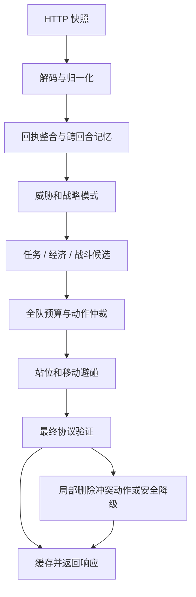

# 《未来战争》Go 参赛程序设计说明书

版本：1.2（增加故障上下文、判题器消息关联与快速复现设计）  
编写日期：2026-09-15  
适用依据：《未来战争》v1.0 任务书、v1.0 接口文档及本目录 Python Demo。

## 1. 设计结论与交付范围

本项目应实现一个 Go HTTP 决策服务：每回合接收判题器快照，维护跨回合记忆，输出角色动作、LLM 提示词和任务沙盒命令。它不是游戏服务器，不应自行推进比赛回合，也不应在本地伪造任务、战斗或奖励结算。

获胜路线是：**保证协议稳定和基地存活，以快速任务带动积分、经济及升级，用地形与联合火力降低防守成本，再按局势争夺宝藏和压制对手。** 初期不能把“三种武器各造一座、所有角色整夜守塔”当作最优策略，而应将其作为可对照的基线。

本文交付可指导开发的架构、算法、数据设计、测试和实验方案；不代表已实现 Go 服务或已验证比赛胜率。当前目录没有官方判题器、实际任务沙盒、编译运行环境说明和完整地图坐标配置，因此所有效果指标都是验收目标，策略优劣必须经官方环境验证。

## 2. 资料依据与 Demo 分析

### 2.1 已分析材料

| 材料 | 用途 |
| --- | --- |
| [任务书](docs/任务书.md) | 游戏规则、任务、积分、胜负和异常机制 |
| [接口文档](docs/接口文档.md) | HTTP 启动方式、输入输出字段、工具调用与结果反馈 |
| [请求示例](docs/request.txt) | 具体 JSON 结构、坐标、物品字符串和兼容性问题 |
| [响应示例](docs/response.txt) | 动作字段形式；不能直接作为合法单回合 JSON 使用 |
| [protocol.py](Demo/CoreGeek/CoreGeek/src/agent/protocol.py) | 部分协议解析、距离、基地占格、动作构造 |
| [grid.py](Demo/CoreGeek/CoreGeek/src/agent/grid.py) | 八方向 A* 寻路 |
| [brain.py](Demo/CoreGeek/CoreGeek/src/agent/brain.py) | 昼夜策略、建塔建墙、角色配塔、最近机器人攻击 |
| [server.py](Demo/CoreGeek/CoreGeek/src/agent/server.py) | POST 服务和异常空响应 |
| main3.py、pyproject.toml、CoreGeek.tar.gz 目录清单 | 入口、依赖和 Demo 打包结构 |

未发现适用的 AGENTS.md。任务书中的地图和弹道插图为外部图片链接，本地没有图片文件；本文不从未核验的图片推导精确建造坐标或射线格子算法。

### 2.2 Demo 值得保留的部分

- 用 `(roundNo-1)%130 < 70` 区分昼夜，采用切比雪夫距离和八方向移动。
- 基地左上角坐标展开为 `(x,y)、(x+1,y)、(x,y-1)、(x+1,y-1)`，与坐标轴方向一致。
- 将协议、路径、决策、服务分开；操作在目标周围找站位，而非直接走进矿区或建筑。
- 攻击命令以武器 ID 为 key、操作者 ID 为字符串 `controllerId`；火箭冷却时不发射。
- 使用空指令集作为异常兜底。该形式应继续通过官方接口测试确认。

### 2.3 Demo 的限制与针对性改进

| 发现 | 影响 | Go 设计 |
| --- | --- | --- |
| 不读取任务、新闻、LLM、沙盒反馈 | 丢失任务积分、任务金币及宝藏 | 独立任务引擎、新闻事件账本、工具反馈状态机 |
| 只采石建墙，无买卖升级 | 初始 75 金币花完后缺少成长 | 采销路线、动态预算、升级收益评估 |
| 未解析敌方单位，障碍图仅含己方、中立和机器人 | 可能反复撞敌方基地、围墙或可见角色 | 全占格地图及失去视野后的风险记忆 |
| 基地附近第一圈取三个塔位、第二圈造墙 | 未验证蓝/黄建造区，且坐标排序不等于战术价值 | 经核验的建造掩码、站位连通性和射界评价 |
| 按角色 ID、武器坐标简单 zip | 移动距离长、开拓者被固定占用 | 枚举角色—炮塔匹配，加入任务机会成本 |
| 每座塔只选最近机器人 | 无集火、溅射、穿透、威胁和过量伤害评估 | 同回合联合攻击优化 |
| 攻击始终只输出一个落点 | 升级后加特林、火箭不满足接口要求的目标数量 | 按等级严格构造落点数组 |
| `claimed` 混用矿点、建造点、移动点 | 不能完整约束冲突；相同矿区也不必禁止多人采 | 资源、动作、站位和移动边分别预留 |
| 多工人建造均检查原始金币 | 剩 25 金币时仍可能同时下达两次建塔 | 全队统一资源账本，逐动作扣减预算 |
| 工人直到夜晚才切换回塔 | 首夜可能丢失关键输出窗口 | 用最短路与缓冲量提前返防 |
| 不利用上回合执行结果 | 失败动作可能不断重复 | 回执驱动重规划和失败原因分类 |
| `grid._first_step` 未处理起点等于终点 | 通用寻路 API 有潜在 KeyError；现有上层部分规避 | 明确定义零长度路径返回值并测试 |

Demo 是协议与基础策略参考，不是规则裁判，也不是充分的竞技对手集合。

## 3. 对任务书的理解

### 3.1 比赛目标及优先级

每局有两个换边半场。两半场都胜则获胜；一胜一负比较两半场总分。单半场存在基地先后毁灭判定，不能仅最大化当前积分。

任务书明确：双方基地先后毁灭时，先毁的一方负；双方均存活到结束时比较积分。同回合毁灭的积分比较、单方基地毁灭而另一方坚持到上限等情况应做完整胜负真值表，以官方裁判为最终依据，不能用一个未经核验的“加权总分”替代终局规则。

规划目标分两层：

1. 硬约束：格式正确、按时响应、避免不可接受的基地毁灭风险。
2. 可行方案内最大化预计半场胜率；无法可靠估计胜率时，用未来任务积分、击杀积分、存活收益和对手压制收益进行排序。

存活十天的积分上限为 `10×(1+…+10)=550`。第 d 天基地毁灭，当天起不再获得生存分，单论生存项损失为 `10×Σ(k=d..10) k`，此外还损失未来任务、击杀与可能的直接胜负。因此升级基地和及时救险价值可能远高于一次高分任务。

完整任务得分为 `R + 5T/Δr`，其中 `Δr=完成回合-接取回合`，T 为超时回合数；部分完成为 `R×通过率`。实际完成金币按通过率计算。示例：R=50、T=30，耗时 3 回合得 100 分，耗时 15 回合得 60 分，说明工具链与经验复用速度是关键竞争力。该算例不包含未知取整规则；Δr=0 的裁判处理也需核验。

### 3.2 核心规则与设计后果

| 规则 | 设计后果 |
| --- | --- |
| 41×32 地图；日间 70、夜间 60，共 1300 回合 | 地图很小，确定性搜索足够快；按天规划、逐回合重算 |
| 1 名开拓者、2 名工人，各一动作 | 控塔、移动、买卖、用药、提交答案之间有机会成本 |
| 全局同时最多 3 座武器，不是每种各 3 座 | 在种类与等级组合上优化，统一计数 |
| 角色没有直接攻击能力，炮塔不能自动攻击 | 每次攻击都必须分配存活且相邻的操作者 |
| 工人白天可建造；拆墙未限白天 | 夜间优先火力、修复、控制，不能临时补建建筑 |
| 角色死亡后次日白天开始后 20 回合复活，背包保留 | 保持背包归属，死亡期间物资不可被其他角色当作可用 |
| 金币全队共享，背包分角色 | 统一金币预算；不能假设物品可转移或丢地捡起 |
| 机器人全图可见；敌方基地、围墙全图可见 | 守家预测使用完整机器人信息；敌方角色、炮塔仍需部分可观测模型 |
| 机器人攻击距离均为 3 | 围墙不能直接等同于阻止远程伤害；操作位需评估三格威胁 |
| 武器攻击、炸弹/眩晕先于机器人移动，伤害回合末结算 | 瞄准当前位置；不能默认被致死攻击的机器人已从本回合移动/攻击中移除 |
| 黑夜结束后残余机器人清除 | 临近日出可用拖延保命替代击杀高血量敌人 |
| 地图矿每采 10 次消失并下回合刷新，余量不足平分仍各得 1 | 矿余量不是公开字段，维护估计并及时重选；不永久锁定单一矿 |
| 每日普通 LLM 调用 3 次，活动任务期间不占该额度 | LLM 专注语义和解题；机械决策用 Go；严禁本地等待模型完成 |
| 合法宝藏尝试无论成功与否都会消耗物品 | 宝藏不是免费探测，先做证据与机会成本评估 |
| 5 次异常后不再调度；进程异常退出不重启 | 限时、协议验证、故障降级优先于复杂算法 |

### 3.3 规则缺口和兼容策略

| 缺口或冲突 | 暂定实现与验证要求 |
| --- | --- |
| `mapInfo.zones` 未包含建造区，地图位置主要依赖外链图 | 提供版本化 MapProfile，显式列出武器/围墙格；通过官方地图确认。未知格不能仅凭 land 判定可建 |
| 请求样例一级加特林射程 4、电磁 7、火箭全图，与表格不符 | 有效的运行时 `attackRange` 优先；缺失时用规则表。记录差异，样例不用于证明平衡数值 |
| 样例缺少 `cooldown`、`targetTeam`、`timeoutRounds` | 使用指针或存在标记；不能把缺字段统一解释成 0/我方目标/立即到期 |
| `response.txt` 有重复 key，宝藏 targetPos 数组后还缺逗号 | 拆成独立动作 fixture 并修正；保留原样例不改，绝不直接作为 JSON 金标 |
| 样例背包 `medicine` 与商品 `Medicine` 大小写不一致 | 内部类型映射与协议原名分离；购买使用商店原名，背包使用经裁判验证的名称匹配，不盲目全转小写 |
| 任务用品 `AcientTablet` 拼写特殊且商品可能换图变化 | 原样保留，动态读取，不“纠正”为 AncientTablet |
| 任务点 2 占两格，“处于任一格”与任务点阻挡移动的描述有歧义 | 暂用占格集合周围一格的可行交互格，核验是否允许站在任务格；不能只取一个坐标 |
| 直线弹道起点描述有角色/武器歧义，建筑是否遮挡不明确 | 隔离 RayModel，验证射线起点、穿格边界、友方建筑与敌方建筑遮挡 |
| 火箭“3 回合冷却空窗”与冷却计数时机 | 每回合读 cooldown；离线计算同时保留间隔 3/4 回合情景，实测后固定 |
| 对敌建筑/角色的精确武器伤害、击杀归属、同回合集火细节不完整 | PvP 火力与抢击杀仅作为待验证策略，不按机器人公式外推 |
| 升级、修复、普通移动、机器人攻击的完整相对次序未给出 | 危机预测按保守情景，建立结算顺序微场景 |
| 波次数量、出生位置、机器人目标选择和攻击节奏缺失 | 逐夜观察并保留多模型，不把自制模拟器预测当事实 |
| 基地四格中哪些格可作为 use/攻击目标、距离如何算 | 占格用于碰撞；交互单独做建筑坐标契约测试 |
| HTTP 路径、方法细节、资源限制、Go 版本未完整给出 | Demo 支持任意路径 POST；初版兼容根路径 POST，部署前做握手和编译环境核验 |

## 4. 总体架构与 Go 工程设计

### 4.1 模块结构

```text
cmd/agent/main.go             启动参数、HTTP server、退出管理
internal/protocol/            JSON DTO、动作构造、协议名称表
internal/world/               快照归一化、占格、视野与回执整合
internal/rules/               已确认规则、MapProfile、可替换弹道/结算模型
internal/planner/             战略模式、统一预算、行动仲裁
internal/navigation/          精确最短路、联合状态 A*、最优性证书、动态重规划
internal/economy/             采销、建造、升级、道具采购
internal/combat/              威胁估计、控塔匹配、联合攻击
internal/tasks/               任务状态机、答案、新闻、宝藏、经验库
internal/sandbox/             命令模板、工具请求与结果关联
internal/memory/              跨回合状态、同回合响应缓存
internal/validate/            动作结构与资源约束检查
internal/replay/              输入输出记录、差分分析
internal/observability/       结构化事件、检查点、故障窗口、复现包导出
cmd/replay/                   离线回放
cmd/arena/                    对战评估入口，适配官方判题器
configs/                     地图、规则版本、策略参数
testdata/                    合法协议样例、回放、微场景
run.sh                       exec 启动已编译 Go 二进制
```

首版优先 Go 标准库 `net/http`、`encoding/json`、`context`、`time`、`log/slog`（若环境版本支持）。固定编译器和依赖版本，运行时不联网下载依赖。没有依据指定当前尚未提供的官方 Go 版本。



### 4.2 关键数据契约

以下是接口设计草案，不是已提交实现：

```go
type Pos struct {
    X int `json:"x"`
    Y int `json:"y"`
}

type RoleCommand struct {
    Action       string   `json:"action"`
    ControllerID string   `json:"controllerId,omitempty"`
    TargetPos    []Pos    `json:"targetPos,omitempty"`
    Name         string   `json:"name,omitempty"`
    Num          *int     `json:"num,omitempty"`
    TaskAnswer   *string  `json:"taskAnswer,omitempty"`
    Item         []string `json:"item,omitempty"`
}

type Response struct {
    RoleCommandMap map[string]RoleCommand `json:"roleCommandMap"`
    Prompt         string                 `json:"prompt"`
    ExecuteCmd     string                 `json:"executeCmd"`
}

type DecisionEngine interface {
    Decide(context.Context, Snapshot, Memory) (Response, Memory, Trace)
}
```

DTO 完整覆盖请求字段；动态未知字段可以忽略，但关键坐标、角色类型、维度错误不能静默信任。`cooldown` 等缺失字段用 `*int`；缺失 attackRange 与明确的 0 分开处理。`taskAnswer` 是字符串，任务要求 JSON 答案时先序列化答案，再写入该字符串，不能擅自改为对象。

响应始终初始化非 nil 的 `roleCommandMap`。待机通过不发送该单位指令表达，不自创 `idle`、`wait`、`repair`、`upgrade`、`transfer` 等动作码。

Memory 至少包含：当前半场本地 epoch、上轮回合号、动作及结果、角色计划、预算承诺、任务会话、待收 LLM/命令请求、每日 LLM 计数、新闻原文及事实、宝藏假设、敌方最后可见记录、机器人轨迹、同回合响应缓存。快照始终高于内存预测，金币和物品不能以“已发出命令”代替“已成功到账”。

### 4.3 回合处理与状态隔离

1. 解码请求，校验地图和必要字段，检测重复请求与半场边界。
2. 对相同 epoch、回合号、规范化输入摘要的请求返回同一响应，避免重复计数和副作用。
3. 合并上轮动作、LLM、命令结果；更新真实资源、失败和任务状态。
4. 先产生确定性可行的基础方案，再在预算内改进候选，保存当前最佳解。
5. 在不可变快照上完成规划，经统一动作验证后一次性提交 Memory 和响应。

若服务进程一半场一个实例，天然隔离；若复用进程，结合回合回退、阵营、teamId 和初始地图识别新 epoch。接口无 matchId，无法完美区别“迟到旧包”和“同队同图新局”，需在握手测试中确认重试和复用约定。战略状态清空；经验证、按任务环境指纹索引的通用解题经验可保留。

同一比赛状态串行提交，禁止 HTTP goroutine 同时修改 Memory。锁内不进行模型等待或外部进程执行；上下文到期取消计算，过期计算不得迟到提交状态。异常恢复发生在内存提交前，防止半更新状态污染下一轮。

## 5. 面向获胜的战略设计

### 5.1 战略模式与角色调度

| 模式 | 触发 | 行动倾向 |
| --- | --- | --- |
| 开局建设 | 第一天且基本防守未形成 | 工人建有效火力、采石保留通道；开拓者寻找高收益任务 |
| 经济成长 | 预计本夜安全且尚有升级空间 | 任务和采销，采购下一次关键升级 |
| 返防 | 剩余白昼接近最慢角色返程时间 | 中止低价值远行，完成必要交货并到达操作位 |
| 常规防守 | 夜间风险可控 | 联合火力；允许冷却窗口内使用道具 |
| 紧急保命 | 基地或关键操作者预计被击穿 | 保命升级、炸弹、眩晕、修墙，暂停可推迟任务 |
| 优势转化 | 防守储备充足、对手存在可验证弱点 | 召唤压力或经核验的 PvP，防止给对手送分 |
| 末局取分 | 剩余回合不足以回收投资 | 快速任务、可兑现击杀，降低无回报建设 |

模式使用风险阈值和迟滞，避免一回合采矿、下一回合返防的来回抖动。角色是资源：两工人承担建设采销，开拓者优先任务；夜间是否让开拓者回塔，取决于它带来的防守增益与丢失任务收益，而非永久固定岗位。

### 5.2 首日计划和昼夜时间预算

初始 75 金币可造 3 座一级武器，也可暂造 2 座留 25 金币周转。两种开局都进入对战实验，不能凭 Demo 选择断言最优。

首日按可达性排计划：工人 A 建关键射位，工人 B 补塔或采首批墙材，开拓者前往有效任务点。每回合重新检查到店距离、工人背包、可操作站位和剩余白昼，不硬编码固定回合坐标脚本。

令 `D` 为到夜晚前仍可执行的白天动作数，`Treturn` 为到已分配操作位的路径长度，`Tfinish` 为当前采销/建造的剩余动作数，返防条件是：

```text
D <= Tfinish + Treturn + collisionBuffer + setupBuffer
```

路径不可达时立即换位或提前处理墙门。使用请求回合验证 70/71、130/131、200/201 等边界；预留至少一个可观测到位回合，缓冲量通过碰撞日志调参。

### 5.3 经济与采购

对每条“去矿—采集—去小贩—卖矿—必要时去商店—返防”路线计算可兑现的净收益：

```text
单位动作收益 = (预计售出数量 × 售出日预计价格 - 预期损失)
              / (移动 + 采集 + 卖出 + 必要采购动作数)
```

商店/小贩快照价是当前事实，新闻用于未来供给和价格预测。不能因为铜单价高就忽略铜矿更远，也不能为等待涨价错过今晚救命的升级。多个品种分别卖出，不能假设一次 sell 清空所有矿。

全队金币分为已承诺支出、夜间救险预留和可投资余额。两工人同回合采购或建设共用账本；不预支本回合尚未结算的出售和任务收入。背包容量按实际物品数计算，物资归携带角色所有。

升级按边际价值排序：

- 基地升级同时增加最大生命并回满血，是有限次数的强力保命手段；须提前把券送到可用位置，不能等预计当回合死亡才去买。
- 武器升级增加射程或弹数，价值依赖机器人路径、集群程度和实际操作时间。
- 一块石头换 1000 初始墙血，潜在投入产出很高，但要扣除采集、运输、建造和阻路成本。
- 升级满血机制允许延后使用获得治疗收益，但需要保守估计到下一次可行动前的伤害，不能为了回血收益赌基地生死。
- 采购炸弹、眩晕、药剂和修墙包要同时算“使用者放弃一回合开火”的成本。

### 5.4 布防与建造

布局候选只能来自 MapProfile 的已验证合法格。评价包括机器人接近路径的覆盖、射程内停留回合、火箭聚群机会、操作位安全、到商店/任务点路径长度以及升级可达性。

每次建造前执行建后连通性检查：基地外出、工人采销、开拓者任务、三人返防至少保留可行路线。移动允许穿过两个障碍之间的对角空隙，因此不能用四邻接洪泛判断封闭，也不能把墙的斜向接触当作严密封锁。

墙用于改变路径、延迟接敌、形成可集中轰炸区域；是否真正改变机器人路径须实测。机器人有三格攻击距离，不能用“有墙”直接判定基地与操作者安全。门口位置随阵营和交通路线调整，不照搬 Demo 固定的东南缺口。

已有高等级武器被覆盖会变成新建一级武器。默认禁止覆盖；只有显式重构计划证明收益且通过裁判确认数量上限处的替换语义，才允许执行。

### 5.5 武器组合的量化比较

| 武器 | 等级 1/2/3 的理论单次输出 | 主要优势 | 限制 |
| --- | --- | --- | --- |
| 加特林 | 10 / 20 / 30 总弹丸伤害 | 无固定冷却，近处持续输出 | 多落点需同一 90° 范围，弹道首个机器人截获 |
| 电磁 | 10 / 20 / 30 总能量 | 射程较长，穿透可分配剩余能量 | 不是沿线每个目标都受完整攻击力 |
| 火箭 | 20 / 40 / 60 中心伤害，另有溅射 | 射程长、无弹道遮挡、密集目标高收益 | 3 回合冷却空窗，操作窗口有限 |

若火箭在第 t 回合发射，之后 t+1..t+3 均不能发射，则周期为 4，单落点中心持续输出为 5/10/15 每回合；若裁判采用周期 3，则为约 6.67/13.33/20。实际按 cooldown 控制，表中均是未计溅射和截断的理论值。

优先实验混合三塔、双持续火力加火箭、双火箭加持续火力；三级全图火箭与三火箭另作高投入候选。不能只比较满级伤害，还要比较达到等级的金币与动作数、操作者风险及首夜表现。

### 5.6 对手压制与末局策略

召唤令每天最多使用 10 张，购买数量和使用次数分开记账。效果发生在对手“下个夜晚”，白天/夜晚使用具体落在哪一波需校准；第十夜后没有兑现机会的召唤不买。

选择召唤的依据是预计新增机器人能否突破敌方防守，而非单看机器人血量。敌方隐藏炮塔必须按区间估计；对手防守充足时召唤可能增加其击杀积分。比较召唤与我方升级、任务采购的胜率增量，批量购买仍需逐张使用动作。

三级火箭攻击敌方全图可见基地是值得验证的候选，但机器人弹道描述不足以确认 PvP 伤害规则。通过微场景确认后才启用。敌方基地已毁时，是否还需追求净积分应按半场/全局赛制分析；接口未提供上半场成绩，不得凭空估计两半场总分优势。

## 6. 路径与战斗算法

### 6.1 寻路最优性要求

**寻路必须在明确的状态、目标和约束下求得最优解；找到可行路径不等于完成最优寻路。** 原设计的六种优先级排列和 729 种一步组合只能优化局部行动，不能保证多回合总代价最优，因此改为完整联合状态搜索；它们仅保留为生成可行上界的辅助方法。

最优性的边界必须写进结果：对已知静态地图可以保证全路径最优，对明确给定的动态轨迹可以保证该模型下最优；未知敌人动作、矿点刷新和隐藏单位使真实未来不可知，不能承诺对实际整场比赛的全知最优。

#### 6.1.1 先固定优化目标

| 场景 | 精确定义的主目标 | 约束 |
| --- | --- | --- |
| 单角色前往交互对象 | 最小到达动作数 | 合法占格、八方向移动、对象交互范围 |
| 三人返防 | 最小全员就位时间 `max(T1,T2,T3)` | 操作位不冲突、角色—武器分配、移动碰撞规则 |
| 带危险区域的路线 | 在指定安全约束内最小到达动作数 | 危险格/时段及允许的风险上限须显式定义 |
| 明确采用加权路线 | 最小累计非负代价 | 成本函数和权重固定，不能把它称为最短回合路径 |

同代价方案可按固定坐标/角色顺序确定性选取，不改变主目标。经济上“去哪个矿最划算”、战略上“是否返防”由上层决定；不能把到最近矿的最短路等同于经济收益最优。

#### 6.1.2 精确图模型

使用 `index=y*width+x` 的连续数组，正常地图只有 1312 格。分别维护中立/建筑障碍、己方角色状态、可见敌人、机器人占格和预测时段。基地展开四格；敌方不可见移动单位只保留衰减风险，不永久设为硬障碍。

水平、竖直和斜向移动均耗一回合。只检验目标格与碰撞规则，不因两侧正交格有障碍而禁止斜移；欧氏距离、曼哈顿距离不能用作这个等价八方向图上的可采纳最短回合启发式。直线段交叉本身也不能凭空认定为碰撞，应仅实现裁判规定的同目标、互换等条件。

每个目的地转换为**全部合法交互格的集合**：矿区/商店周边可站格、任务点所有占格的交互范围、炮塔可操作位。保留所有合法站位，不能先按坐标取第一个，也不能为了加速截掉远一些但能减少联合拥堵的站位。基地与任务点的交互距离遵循校准后的专用规则。

#### 6.1.3 单角色精确最短路

静态等权图采用从所有合法目标格出发的反向多源 BFS。距离表 `d[v]` 给出从任意格到任一合法目标格的最少移动次数；沿满足 `d[next]=d[current]-1` 的合法边重建路径。起点已在目标集合时路径长度为 0，无可达目标则明确返回不可达。

最优性依据：等权图 BFS 按距离层遍历，节点第一次确定的距离就是最短距离；多源初始化等价于对全部合法终点同时求最短路。若规则形成有向边，反向搜索必须沿反向边，不能直接复用无向邻接。

带非负移动成本时使用 Dijkstra；需要 A* 时，启发式采用去掉动态障碍后的精确静态距离下界，或 `min(Chebyshev(pos, goal)) × 最小移动成本`。禁止加权放大 h、Beam 截断、限制邻居数量等会丢失精确性的优化。若允许零成本边，下界也必须相应调整，不能默认最小成本为 1。

#### 6.1.4 三角色协同：联合状态 A*

为保证多回合协同最优，默认精确求解三角色联合状态图，而不是逐个角色独立最短路后再修补碰撞。

```text
静态状态 S = (pos1, pos2, pos3)
动态状态 S = (pos1, pos2, pos3, 相对回合 t)
动作      = 三个角色各自八方向移动或等待的组合
边代价    = 一个同步回合
终止条件  = 三个角色同时位于满足任务分配的合法目标格
```

每个联合状态最多生成 `9³=729` 个后继，不是整次规划只检查 729 次。逐后继拒绝静态障碍、同格争夺、角色互换、已知动态占格和其他已核验冲突。己方角色通过联合状态表示，不能同时把它们的初始位置永久加入静态障碍，否则会错误排除让路方案。

提前到位者可以继续等待或暂时让路，不永久冻结；若角色已开始持续控塔/执行任务而不可离位，则显式锁定其允许动作。仅三人返防时，终点为全员同时就位，因而单位边代价之和恰好等于最大全员到达时间。需要研究“边走边采集/买卖/建造”时，必须扩充动作与资源状态，不能以纯移动图宣称整体生产计划最优。

角色—炮塔分配不提前贪心固定。最多枚举六种双射，连同有效的部分分配，分别求解并取最小成本；仅当上层允许闲置时才纳入部分分配，不能通过少安排角色人为降低返防目标。每个分配下保留完整目标格集合，由联合搜索选择互不冲突的实际站位。

对固定分配，使用 `h(S)=max(d1[pos1], d2[pos2], d3[pos3])`。di 是忽略其他移动角色与未来动态障碍后的反向 BFS 距离，因此真实协同就位时间不会小于任何 di，h 不高估。对同时规划全部分配，也可取各合法分配下该值的最小值作为下界。

优先队列按 `f=g+h` 弹出，保存各状态最小 g 和父指针，发现更小 g 时更新/必要时重开。弹出的目标状态若达到全局最小 f，则其成本最优；也可在已有解成本 U 不大于全部剩余 OPEN 的最小 f 时终止并证明最优。多分配求解时，比较所有未排除分配的下界，不能只证明某一个固定分配最优就宣称分配也最优。

#### 6.1.5 动态路线和模型边界

已知未来占格时采用时间展开图，每一步检查 t 到 t+1 的位置、边和机器人碰撞约束。状态去重包含 t，因为同一位置在不同回合有不同可行性。使用绝对回合关联昼夜、任务截止和已知的眩晕解除窗口。

有限时域 H 内的搜索只能证明“在 H 内”的最优或不可行。若找到成本 U≤H，且每步成本为一回合、搜索没有裁掉代价低于 U 的状态，则 H 外的更晚到达不可能改进该到达时间；若没找到解，则不能据此报告全程不可达。截止日出/比赛结束等真实 deadline 可以作为合法搜索上界。

敌方未来行动无法确定时，用多个情景或保守禁行时段形成明确模型。保守禁行会牺牲真实最短路，只能称为该安全约束下最优。每回合执行联合路线的第一步，收到快照后修正模型并重规划；不能把滚动窗口内最优说成未知未来下的全局最优。

连续移动失败触发重规划、换站位或让路；不能把一次 false 永久解释为墙。障碍、目标集合、分配、危险模型或时间基准变化均使对应缓存失效。静态距离缓存按地形版本和目标集合索引；未受影响的表可复用，不能使用失效缓存冒充精确答案。

#### 6.1.6 限时计算与最优性证书

最优性是算法验收要求，但任意复杂动态场景下的精确搜索可能超过比赛硬时限。不能用超时输出冒险，也不能将降级结果标成最优。每次规划返回以下内部信息：

```text
PathResult = 路线、代价 U、下界 L、适用规则/地图版本、目标与分配、
             搜索时域、展开状态数、结束原因、optimal 标记
```

只有完成精确搜索或已证实 `U=L` 时 `optimal=true`。提前终止有可行解时返回 `optimal=false`、差距 `U-L`；无可行解时另记 Unknown，不能伪称 Infeasible。下界由可采纳启发式与完整未探索前沿得到；若发生内存裁剪且未保留有效下界信息，则不得继续声称持有完整 OPEN 的证明。

常规静态单人寻路必须精确完成。三人返防用完整联合 A* 作正确性基线，优先提前规划、复用上轮可行路线和静态距离表降低耗时；六种优先级规划可提供 U 以便剪掉 `g+h≥U` 的分支，但若 U 路线失效必须撤销该上界。任何更快替代算法都须通过精确求解器对照后引入。

联合搜索达到时间/内存预算时使用已验证可行方案并报告未证明最优，比赛 HTTP 仍按时返回。该情况属于未满足本次最优性指标，必须进入性能优化和对战报告，不能通过降低目标标准隐藏。不存在对任意未来未知局势同时保证全知最优和固定毫秒耗时的设计承诺。

#### 6.1.7 最优性验收

- 单角色：在小地图枚举障碍、起点及多目标集合，对照独立 BFS/Dijkstra 的最短距离；要求距离完全一致，不仅检查路径能走通。
- 三角色：小地图以无启发式联合 BFS 作为独立 oracle，比较联合 A* 的全员就位时间和可行性；覆盖窄路让行、先后绕行、角色互换、目标站位争用、提前到位后让路，以及贪心分配失败案例。
- 分配：穷举合法分配和目标站位的微型案例，验证最终方案不漏掉更优分配；三人互不阻碍时成本应等于相应最优分配的最大独立距离。
- 动态：给定确定占格序列，以时间展开 BFS 对照；等待可行、窗口错过、机器人争格和 horizon 不足分别测试。
- 证书：所有 `optimal=true` 用例必须满足 oracle 成本相等；超时/裁剪/预测模型变化不能继续沿用旧 optimal 标记。
- 性能：在完整 41×32 地图的真实返防与拥堵回放上记录证明最优的比例、P99 耗时、峰值内存、展开状态数和未证实差距。验证集要求全部计划获得最优证书；达不到即继续优化，并明确报告未达标场景。

### 6.2 威胁预测

每只机器人保存类型、HP、目标阵营、当前位置与历史位移。预测 `接近关键单位时间`、`可攻击回合`、`可施加伤害`、`被我方消灭时间`；缺失 targetTeam 时结合轨迹形成未知/可能目标，不强行归类。

威胁评价优先：即将破坏基地，其次即将杀死操作角色，再次摧毁关键炮塔/墙，最后才是低风险取分目标。对日出前不会接敌的机器人降低防守优先级；眩晕仅给出状态而无剩余回合时，维护带误差的剩余时间范围。

由于机器人速度、仇恨、攻击频率不完整，初版采用保守近距危险模型，后续根据回放拟合多个候选模型。只有经过判题器对照的模型才参与高风险决策。

### 6.3 联合攻击与操作者匹配

先枚举最多 3 名角色到最多 3 座炮塔的可行匹配，包含闲置选项。约束操作者存活、周围一格、每人最多一塔，且不能同时移动、提交答案或使用道具。匹配评分包含即时输出、未来返位成本和开拓者任务机会成本。

对每座可用炮塔生成攻击候选：

- 加特林：以机器人方向生成有限扇区，落点数严格等于等级。任意两非零目标向量点积必须非负，避免用角度浮点误差；再经 RayModel 找每颗子弹的首个命中机器人。重复落点是否允许须确认，不能依赖它凑数。
- 电磁：枚举高价值射线终点，按经过的机器人顺序消耗总能量，避免把 30 能量误计成每只 30 伤害。
- 火箭：以机器人位置及周围八格为中心候选，计算中心 20、邻格 10 的伤害矩阵。最佳中心可能是空格；多枚落点重叠按规则累计，允许的具体数组形式用微场景验证。

每塔保留约 8–16 个多样候选，再进行束搜索或枚举组合，并包含暂不攻击选项。组合价值取决于：预计击杀收益、消除的基地/角色伤害、有效削血、过量伤害和机会成本。

必须对一组同时攻击按官方结算语义联合估值。不能简单扣除“预测剩余 HP”后把已分配致死伤害的前排机器人从另一条射线中删除，因为伤害在回合末结算。未核验时，保留当前占格与当前 HP 的保守命中模型，降低依赖跨塔穿透连锁的候选评分。

### 6.4 道具与救险

炸弹和眩晕同样使用 3×3 候选中心，按减少的未来危险比较。炸弹对双方机器人有效，对建筑角色无效；误炸本可拖延到天亮的远端机器人可能浪费 100 金币。眩晕价值是争取输出、逃生或等待日出的回合，不是直接伤害。

火箭冷却期间操作者可用药、用券、修墙或使用召唤令，但需保证下一次发射站位。药剂按预计存活收益决定，不能仅用固定 HP 百分比；修墙也要确认使用距离和伤害结算次序。

## 7. 任务、LLM 与跨日推理

### 7.1 任务优先级与生命周期

任务点按己方阵营、isValid、冷却和可达性筛选。评分综合任务积分、加速奖励、金币对防守的价值、历史成功率、路程及夜间危险。任务点冷却 30 回合期间可以转另一点，但必须比较往返成本；活动任务中不能为转点而意外离开一格交互区。

```text
无任务 → 前往交互格 → 发送 acceptTask → 等待 phaseTask 确认
      → 识别任务/查经验 → 规划工具请求 → 等待结果
      → 生成答案 → submitAnswer → 等待反馈
      → 完成 / 部分答案继续修正 / 超时 / 离点终止 / 死亡终止
```

不以已发出 acceptTask 判断任务已开始。任务结束后清理会话内待收结果，记录任务结束回合和点位冷却。部分答案错误不直接等于任务结束；接口说明超时按之前最高通过率计算，应尽早提交有依据的部分答案，再继续改进。

提交答案占开拓者一动作，与控塔冲突。截止前保留至少一次提交与回执窗口；不能在最后一回合才发命令并期待同回合读回结果。phaseTask 消失、角色死亡、点位信息和 errors 一起判断状态，不能只凭积分变化，因为击杀和存活也会改变积分。

### 7.2 LLM/沙盒是跨回合管线

响应中的 prompt 交给判题器调用 LLM，下一回合通过 llmResp 返回；executeCmd 的结果通过 lastCmdResult 返回。HTTP 服务不得阻塞等待二者，也不在本机运行本该由判题器沙盒执行的命令。任务中的模拟 API 应在提供的无外网沙盒内调用，不能按示例去访问公网天气服务。

```text
回合 r   : 发 acceptTask
回合 r+1 : 确认 phaseTask，命中经验则直接生成命令；否则发 prompt
回合 r+2 : 消费模型方案，校验后发 executeCmd
回合 r+3 : 消费命令结果，构造确定答案并 submitAnswer
回合 r+4 : 检查结束或错误，更新经验
```

这是串行保守例子。prompt 与 executeCmd 只有互不依赖时可同回合发送；不能把本轮尚未返回的模型内容用于本轮命令。已有经验时省掉模型往返，是加速奖励的主要来源。

每条待收请求记录任务会话、发出回合、类型及输入摘要。接口没有请求 ID，不通过字符串相同判断“旧结果”；默认每通道只保留一个待收请求，重复 HTTP 请求由响应缓存保证幂等。切换任务后迟到结果不得应用到新题。

解析 lastCmdResult 的 `[exitCode:N]`、`[TIMEOUT]`、`[JUDGER_ERROR]` 和 `[TRUNCATED]`。失败时按原因做有限重试；大输出先在沙盒中筛选为必要字段，避免 64KB 截断。沙盒执行上限 15 秒独立于我方 HTTP 5 秒响应限制，不得混为一个预算。

### 7.3 自进化经验库

经验键由任务族、描述结构指纹、接口/文件版本、环境特征组成；值包含参数提取器、已验证命令模板、输出解析器、答案 schema、适用条件、成功次数和失败记录。复用方法而非上一次城市、日期或题目的答案。

首次任务探索“输入位置—可用程序/接口—字段映射—答案要求”，成功后固化 Go 参数提取与沙盒脚本模板。同族后续题尽量直接执行；环境指纹变化或连续失败则退回探索。测试集中保留未见题型，防止只适配公开例题。

LLM 输出要求结构化：任务族、证据、下一步命令提案、答案字段与不确定项。模型输出不直接成为动作 JSON；命令使用任务相关模板，长度受限，参数以可靠的序列化/编码传递，避免将题目文字直接拼成 shell。该设计用于减少转义错误与误操作，不要求给比赛任务增加人工审批。

### 7.4 新闻与宝藏

官方消息存成带生效时间的事件：资源、采集状态、价格趋势、起止日、证据原文、置信度。示例矿难应展开为“今天可采、明后两天停、再后恢复”，而不是关键词匹配后当天停采。

民间传闻保存所有日原文和结构化事实，形成 `地点候选 × 开启时间区间 × 精确物品多重集合 × 前提条件`。每个结论保留来源日与原句；新线索可排除旧假设但不删除原始证据。物品从本局商店识别，不预设永远只有示例六种。

每日三次普通 LLM 调用按价值分配，例如先合并处理新闻与传闻，再保留额度解决歧义；不是每轮查询一次。活动任务期间额度豁免以已确认任务状态为准，任务结束后立即恢复配额管理。被报额度错误时停止普通请求并记录校准，不盲重试。

宝藏执行前检查：开拓者存活、距目标一格、开启时机、背包精确包含献祭项、无额外/缺失物品，以及风险收益。单次失败成本包含物品价格、购买与往返动作、丢失任务/防守机会。

结果码更新方式：0 不构成探测证据；1 记录成功并停止；2 只能说明坐标或时机至少一个不符，不能直接排除坐标；3 说明组合不符；4 宝藏已空，停止投入。合法失败也扣物品，以次轮背包为准。高置信线索下提前采购、提前到位，在可开回合立即操作；双方同回合正确可共享奖励。

## 8. 协议正确性与性能

### 8.1 输出前的统一验证

| 动作 | 结构与关键约束 |
| --- | --- |
| move | 一坐标、八邻接、地图内、占格与己方预留不冲突 |
| attack | key 为武器 ID，controllerId 为字符串；夜间、冷却、距离、操作者互斥；电磁一个落点，加特林/火箭按等级 |
| build | 工人、白天、name、单坐标、合法建造掩码、材料/金币、总塔数 |
| remove / collect | 工人、单坐标、邻接正确对象；remove 不当作免费回收 |
| buy / sell | 商店/小贩邻接、name、正数 num、资金/背包/数量可行 |
| acceptTask | 开拓者、己方有效任务交互格、无冲突任务会话 |
| submitAnswer | 开拓者、已确认活动任务、taskAnswer 字符串 |
| summonTreasure | 开拓者、单坐标、item 数组、范围与背包多重集合 |
| use | name；升级券/修墙/炸弹/眩晕所需坐标齐全；其他按物品契约 |
| drop | name 且背包有该物品，不假设能够转交同伴 |

动作结构错误与执行失败分别统计。碰撞、空射等规则执行失败不自动计为队伍异常；字段缺失、动作码不识别、格式和 HTTP 超时才触及任务书异常机制。`errors` 里的任务答案错误、模型额度错误也不等价于队伍异常计数。

验证失败优先只删除冲突动作，保留其他合法保命指令；整体不可用时返回 `{"roleCommandMap":{},"prompt":"","executeCmd":""}`。空动作是最后兜底，不能替代长期防守策略。

### 8.2 时间预算

官方限制：建连超过 10 秒超时，发送请求后 5 秒未收到响应超时。以下是首版预算目标，需在官方规格上实测：

| 阶段 | 软预算 |
| --- | ---: |
| 读取、解码、归一化 | 100 ms |
| 状态更新与确定性基础方案 | 100 ms |
| 路径、任务、经济规划 | 250 ms |
| 战斗候选与联合搜索 | 800 ms |
| 验证与序列化 | 100 ms |
| 常规规划软截止 | 接收请求起 1.5 s |
| 最迟降级并开始返回 | 接收请求起 3.5 s |

目标为典型回合 P99 小于 200 ms、压力回合在 1.5 s 内完成常规规划；两者分别是优化指标与软上限，不是实测结果。控制服务启动到监听的时间，HTTP 读写超时、请求体上限根据最大合法样本与资源配额配置，不能用过小 body 上限拒绝合法长任务。

搜索采用 anytime 形式，周期性检查 context，超时用已经保存的基础方案；不能只设置 HTTP 超时而让计算继续占 CPU。断开客户端取消未提交工作，复用同回合缓存处理重试。

### 8.3 算法复杂度与资源

地图 BFS 为 `O(V+E)`，V=1312，E≤8V。三角色联合状态图静态最坏可达 `O(V³)` 个状态，每状态最多 729 个后继；时间展开再乘时域因子 H。因此不能因只有三个角色就声称联合最优寻路始终很便宜。采用稀疏状态表、精确下界、可行解上界和提前规划，分别统计导航与战斗预算；有限预算不足时按 6.1.6 返回未证明最优的状态。武器数最多 3，每塔截断 K 个攻击候选后朴素联合为 `O(K³)` 组，但每组伤害估值另有机器人数量因子，必须预计算稀疏伤害矩阵。战斗候选裁剪与导航精确搜索分离，不能把战斗束搜索用于声称路径最优。

火箭候选中心去重后不超过地图格数；用局部 3×3 汇总或空间索引评分，避免每中心遍历所有机器人。多落点组合先用边际收益/束搜索裁剪，不能直接枚举全部 `1312³`。模型不确定性只对排名靠前方案做多情景推演。

固定地图数组和可复用 slice 优先于大量 map 分配；保留 pprof/benchmark 的离线入口。先通过数据确认 GC 或序列化瓶颈，再考虑池化和并行；不为 1312 格地图引入复杂 goroutine。内存、日志磁盘和最大任务文本预算待官方资源配额确定，日志采用有界缓冲/轮转，完整回放主要用于本地训练。

日志采用第 9.4 节的结构化事件与内容寻址原文归档：控制台打印摘要，原始消息与状态进入复现文件，避免长 prompt 和地图反复刷屏。归档压力必须有显式丢失记录与复现完整性标志，不能静默丢失证据后声称可完整复现。

## 9. 可测试性与验证方案

### 9.1 分层测试

| 层次 | 测试内容 | 验收 |
| --- | --- | --- |
| 协议契约 | 所有动作独立 fixture、字段缺失、字符串 ID、答案嵌套、空集合 | 输出可解析、无重复 key、缺少必填项能被本地拒绝 |
| 规则单元 | 距离、基地四格、昼夜边界、等级/数量限制、升级物品匹配 | 与任务书示例及官方微场景一致 |
| 路径属性与最优性 | 随机障碍、斜角通行、零长度路径、多目标、三人拥堵、动态时域；独立精确 oracle 对照 | 每步合法，成本与 oracle 一致；最优性证书真实，未完成搜索不误报不可达 |
| 联合动作 | 两工人争 25 金币、两人抢格、互换、控塔兼移动、背包不同归属 | 不输出自身可预测的资源或动作冲突 |
| 战斗数值 | 锥角 90° 边界、射线穿格、穿透能量、火箭溅射与重叠、冷却 | 不高估有效伤害，边界与官方一致 |
| 任务状态 | 部分答案、离点/死亡/超时、30 回合冷却、任务跨日 | 不串题、不误收旧工具结果、不丢最高质量答案策略 |
| 工具反馈 | exitCode、超时、截断、模型坏 JSON、空/重复结果 | 有限重试、安全降级，HTTP 不等待工具 |
| 新闻宝藏 | 跨日时序、互相矛盾线索、重复物品、结果码 0–4 | 不免费试探、不误判坐标证据 |
| 生命周期 | 重复回合、异常断连、panic、回合回退、换边 | 幂等、状态隔离、服务保持可用 |
| 性能压力 | 大机器人集合、长新闻/题目、围墙密集、日志压力 | 达到实测延迟与内存门槛 |

使用表驱动 Go 单元测试，结合 `go test -race ./...`、Go fuzz 和 `go test -bench . -benchmem`（以官方 Go 版本支持为准）。随机测试使用固定种子并保留失败输入；伪时钟、LLMStub 和 SandboxStub 注入，不让测试依赖真实模型或回合墙钟。

`Decide` 对相同快照、记忆、参数和随机种子产生相同输出；统一排序 map 导出的候选，避免 Go map 遍历随机性破坏回放。回放 trace 记录选择理由、被否决约束、预测伤害和预算耗时。

### 9.2 官方裁判校准优先级

在优化胜率前完成以下最小实验：

1. 确认 HTTP 路径、空响应、攻击 map key、controllerId、回合起点和重试行为。
2. 确认双方建造掩码、基地交互格、任务点 2 交互范围、三塔总数和覆盖行为。
3. 确认火箭冷却与多落点、90° 边界、弹道遮挡、穿透与回合末伤害。
4. 确认移动争格、互换、链式跟随及机器人同回合致死后行为。
5. 确认任务部分答案、反馈字段、取整、完成分母、LLM 日切和任务内豁免。
6. 确认 PvP、召唤兑现夜晚与每日上限、宝藏扣物品、升级/修复的结算先后。
7. 确认完整终局真值表，尤其单方基地被毁、异常停调度和同回合毁灭。

每个实验保存输入、动作和实际输出，形成可重复的裁判规则测试。未知规则使用独立配置开关并记录证据版本，不散落在策略代码里。

### 9.3 回放、模拟器与对战

离线回放只能验证已发生快照上的响应质量，不能证明改变动作后的胜率。轻量模拟器用于搜索、规则单测和策略筛选；官方判题器用于最终胜负评估。没有官方判题器时，只能报告协议测试、合成场景和假设下模拟结果。

对手池包括原始 Demo、修复明显问题的基础策略、纯防守流、快速任务流、火箭聚群流、召唤进攻流以及历史最佳版本。记录对手版本，避免只对弱 Demo 过拟合。

每个随机种子都跑双方换边完整一局。正式晋级实验建议至少 200 个配对种子，即 400 个半场；同时按地图/任务族分训练、调参和保留集，宝藏与任务变化不能只记住训练答案。

核心指标：完整局胜/平/负及联赛积分、半场基地毁灭回合、两半场累计得分、任务完整通过率与完成耗时、宝藏成功率、有效击杀、有效开火率、无效动作原因、HTTP P95/P99/max、异常次数。任务内部未提供逐题准确分数时标为估算，不从 totalScore 增量武断归因。

胜率置信区间按配对完整局而非把相关半场当独立样本计算；可使用按种子 bootstrap。候选版本晋级要求协议/超时异常为 0、保留集总表现改善、关键对手无不可接受退化；置信区间过宽时扩样，不能以单局高分宣称策略更强。

消融实验分别关闭快速经验复用、联合攻击、提前返防、新闻预测、宝藏、召唤，判断每个模块的实际贡献。若复杂模块没有可重复增益，保留为实验选项而不放入默认比赛配置。

### 9.4 快速定位：上下文记录与复现包

#### 9.4.1 最小复现闭环

**只有判题器请求和程序输出，通常不足以复现一个有跨回合记忆的决策。** 最小闭环为：

```text
精确程序版本 + 实际生效配置/地图规则 + 回合 r 的原始请求
+ Decide 前 Memory/随机状态 + 影响决策的时间与搜索预算
→ 重跑 Decide → 对比当时实际响应、Memory 后状态和决策理由

回合 r 的实际响应 + 回合 r+1 的判题器原始请求
→ 关联动作结果、errors、LLM/沙盒/宝藏反馈和快照变化
```

这里的 r+1 表示接口约定的下一回合，而非本机收到的下一个 HTTP 请求；重试、乱序、缺包必须分开处理。终局、进程崩溃或停调度后可能没有下一回合，需保存未完成闭环，不能补造成功/失败回执。

区分三种复现能力：

| 层次 | 所需材料 | 能回答的问题 |
| --- | --- | --- |
| 单回合决策复现 | 原请求、前状态、原二进制/构建、配置、确定性预算 | 为什么当时选这个动作？同样输入是否还会选它？ |
| 跨回合代理回放 | 检查点及之后完整请求流、外部工具结果、动作记录 | 记忆何时首次偏离？任务结果是否串会话？ |
| 判题器重新结算 | 官方引擎版本、完整状态/种子与随机状态、双方动作、外部结果 | 为什么动作被判失败？碰撞、弹道、伤害是否按预期结算？ |

前两层由 Go 参赛程序自行支持。第三层需要官方判题器配合，当前接口没有提供完整隐藏状态、对方动作和结算轨迹，不能仅靠本方日志精确重演裁判内部过程。

#### 9.4.2 每条事件必须带的关联字段

统一输出 JSONL，一行一个事件，不依赖多行自然语言日志拼接。公共字段如下：

| 字段 | 含义 |
| --- | --- |
| `schemaVersion`、`event`、`level` | 日志模式版本、事件种类、严重级别 |
| `runId`、`epoch`、`teamId`、`side` | 进程实例、本地半场标识、队伍和阵营；官方 matchId 若未提供就不伪造 |
| `requestSeq`、`requestId`、`roundNo` | 本机递增请求序号、请求实例 ID、判题回合号；重复回合同样拥有独立请求实例 |
| `decisionId`、`attempt`、`reusedDecisionId` | 决策与请求重试/缓存复用关联 |
| `wallTimeUTC`、`elapsedUs` | UTC 时间和进程单调耗时；耗时计算不依赖系统时钟跳变 |
| `buildHash`、`configHash`、`ruleHash`、`mapHash` | 代码、实际配置、规则、地图版本 |
| `requestRawHash`、`requestSemanticHash` | 原始字节摘要与规范化 JSON 摘要，分别识别原文和语义差异 |
| `memoryBeforeHash`、`memoryAfterHash`、`responseHash` | 决策前后状态与实际输出关联 |

`day`、`phase`、`roundInDay` 作为可读派生字段记录，并保留原始 roundNo，便于定位昼夜偏移。哈希用于查找与完整性校验，**不能代替原文和状态文件**。缓存命中要记录来源决策，不能当作又执行了一次任务/预算扣减。

#### 9.4.3 必须保存的判题器消息

| 输入内容 | 保存要求与定位价值 |
| --- | --- |
| HTTP 方法、路径、协议版本、必要头、接收长度、读取错误 | 区分错误路由、请求体截断、解析错误、连接问题 |
| 原始请求 body | 解析前保存精确字节；保留字段缺失、null、空字符串、大小写和原始数组，不只留格式化后的 DTO |
| `roundNo`、`mapInfo`、`teamOur`、`teamEnemy`、`robot` | 原样归档，用于资源、占格、可见性、血量和冷却复现 |
| `playerTasks` 与 `phaseTask` | 记录完整题目、任务元数据及缺失字段，关联任务会话 |
| `lastRoundRoleActionResults` | 保留原始 key/value；缺失 key 不解释成 true，也不解释成 false |
| `errors` | 原始 errorCode、description、所在请求回合；不能仅打印“指令错误”而丢正文 |
| `llmResp` | 完整字符串、字节数和本地归档截断标志，与先前 prompt 配对 |
| `lastCmdResult` | 原始头、退出码/超时/异常/截断标志、输出全文，与先前 executeCmd 配对 |
| `lastSummonTreasureResult` | 原值、先前目标和献祭物品，核对下一轮背包变化 |
| `worldNews`、`vendorShopList`、`weaponShopList` | 原文、原价、商品原名；用于新闻时间与经济决策复现 |

相同长文本或相同完整 body 可按 SHA-256 内容寻址只存一份；每次请求仍记录独立引用和字节数。判题器自身的 `[TRUNCATED]` 与我方日志丢失/截断是两类不同事件，必须分别标记。

#### 9.4.4 决策前后需要打印和归档的上下文

控制台摘要打印“决策结果与关键理由”，完整状态归档到文件。建议按以下模块记录：

| 模块 | 必需上下文 |
| --- | --- |
| 全局决策 | 当前模式、模式切换原因、硬约束、动作优先级、各阶段耗时、deadline 与降级原因 |
| Memory | 本轮输入整合前后状态、Decide 的准确前状态、提交后状态；检查点版本、随机数生成器完整状态、计划和缓存依赖版本 |
| 角色 | ID、位置、血量、背包、当前任务、目标对象、操作位、可用动作；死亡/复活判断证据 |
| 资源仲裁 | 原始金币、保留金币、各动作承诺支出、按角色的物品预留、被取消动作及原因 |
| 动作生成 | 候选动作、候选代价/收益、最终选择、关键淘汰原因、tie-break 规则；普通回合存摘要，故障详细轨迹存候选引用 |
| 最终验证 | 原计划与最终输出的差异，每条删除/改写指令的规则编号、相关实体和约束值 |
| 预测与反馈 | 预计下一步位置/伤害/物资变化、实际观察变化、差异；“预测不符”不直接等于判题器错误 |
| 提交过程 | Memory 提交序号、序列化完成、HTTP 写入开始/结束、写入字节数和错误、取消/panic 堆栈 |

影响结果的缓存要么能由检查点确定性重建，要么归档其内容与版本。若缓存只影响速度，也可能影响限时搜索结果，因此还需记录搜索完成边界，不能仅保存随机种子后声称完全可复现。

#### 9.4.5 寻路故障专用证据

为验证“走错、绕远、原地等待、撞人、未证明最优”，每次寻路 trace 至少包含：

- 规划 ID、对应角色集合、起点、**全部合法目标格**、角色—炮塔分配、目标函数、时间范围与规则版本。
- 静态障碍、动态占格和风险约束的网格快照/可重建引用；每个被禁格的来源实体、时段与原因。
- 启发式类型、地图距离表版本、可行上界来源、联合路线及逐时刻位置，尤其明确 WAIT 是计划动作还是失败后的停留。
- `U`、`L`、`optimal`、结束原因、已展开状态数、OPEN 大小、峰值内存、实际使用预算；没有上界/下界时显式 null。
- 关键剪枝统计：障碍、同目标、互换、风险、代价界各剪掉多少状态；异常情况下记录具体冲突见证。
- 本轮实际发出的第一步、下一轮实际位置、对应动作结果和占格变化。

默认不逐节点打印整个 A* 搜索树。完整输入加确定性展开顺序可以离线重跑并按需打开节点级 trace；只有调查非确定性或实现错误时才抓详细搜索记录。

#### 9.4.6 战斗与任务故障专用证据

战斗保存武器/操作者 ID、双方坐标、等级、运行时射程、冷却、落点数组、弹道经过格、命中顺序、每个候选的伤害分配及过量伤害。下一轮记录单位消失、HP 变化与命令回执，区分“没开火”“没命中”“模型伤害估计错误”。由于对方也可能造成伤害，HP 差不能独自证明我方命中数值。

任务保存 taskSessionId、原始题目引用、接取发出/确认回合、截止估计、点位距离、经验条目及版本、匹配参数、prompt/executeCmd/taskAnswer **最终发出原文**。每个工具通道记录唯一待收调用、本轮响应关联依据、重试次数、解析错误和答案更新理由。新闻宝藏另外记录事实证据来源、假设变更和献祭物品的精确多重集合。

模型与沙盒使用录制结果回放，默认不重新调用 LLM、不再次执行命令；否则模型随机性、文件副作用和环境变化会污染复现。需要重跑真实沙盒时，另行保存任务初始文件、相关文件变更、依赖版本和工作目录；若参赛程序无法获取这些材料，应标记只能复现“工具结果消费”，不能保证重新解题结果相同。

#### 9.4.7 跨回合因果链与失败分类

每回合固定记录事件链：

```text
request_received → request_decoded → feedback_linked → state_prepared
→ plan_finished → commands_validated → memory_committed
→ response_write_started → response_write_finished
→ next_round_feedback_linked
```

事件链描述的是程序实际发生的顺序，不把“HTTP 写入成功”写成“判题器已接受”。即便 Write 返回成功，也只能证明本地写操作成功；裁判是否及时接收、是否完成解析，需要下轮反馈或判题器端日志证实。

例如回合 71 的武器命令用 key 10020、controllerId 10010，回合 72 反馈 key 10020 为 false：关联武器命令并同时展示操作者位置，不错误查询 10010 后报“没有回执”。反馈 key 的裁判实际口径应通过握手实验确认，原 map 永远保留。

定位报告分层输出：

1. **传输故障**：读取/写入错误、超时、取消、判题器停调度，先看连接与时间线。
2. **协议故障**：原始响应是否有效 JSON、动作字段与类型是否完整。
3. **确定性/状态故障**：同版本重跑是否先在 Memory 或响应发生差异。
4. **规划故障**：同输入重跑一致，但资源、寻路、威胁或任务策略违反预期。
5. **规则/外部影响待核验**：本地验证通过但反馈失败，可能为敌方动作、未知规则或模型误差。

仅有 boolean false 时报告“已知失败、原因待证实”，同时列出距离、占格、资源等可核对证据；不能根据猜测直接写“金币不足”或“判题器 bug”。

#### 9.4.8 复现包结构与一键命令

```text
repro/<runId>/<epoch>/round-0071/
  manifest.json          版本、故障回合、完整性、摘要、文件清单
  build.json             Go/GOOS/GOARCH、构建参数、二进制 hash
  config.json            实际生效配置，包含默认值与覆盖项
  rules.json             规则/地图配置与证据版本
  memory.before.json     失败回合准确的决策前状态
  memory.after.json      当时实际提交后状态；未提交则显式标记
  request.raw.json       原始 body；坏 JSON 同样按原字节保存
  response.raw.json      实际序列化的响应；未生成则显式标记
  feedback.raw.json      下一回合请求；尚未收到则 manifest 标记缺失
  events.jsonl           HTTP 与决策阶段事件
  trace.json             动作、路径、攻击、任务关键证据
  checkpoints/           可用的较早状态快照
  rounds/                故障前后请求/响应及状态引用
  blobs/                 新闻、题目、LLM/沙盒原文等去重对象
```

build.json 同时引用可取回的原二进制或源码归档。只有 git commit 不足以还原未提交修改；无 Git 项目时用源码文件清单及内容摘要，并保存实际发布源码包。manifest 标记 `decisionReplayComplete`、`feedbackComplete`、`judgerReplayComplete`，逐项列出缺失材料。

以下为拟实现的 CLI 契约，不表示当前已经存在这些 Go 命令：

```bash
agent-replay verify --bundle repro/.../round-0071
agent-replay decision --bundle repro/.../round-0071 --compare
agent-replay timeline --bundle repro/.../round-0071 --from 65 --to 73
agent-replay explain --bundle repro/.../round-0071 --role 10010 --module navigation
agent-replay diff --bundle repro/.../round-0071 --candidate ./agent-new
```

verify 检查哈希、文件引用、模式版本及前后状态链；decision 用录制 Memory 与输入重跑；timeline 找到首次状态或输出分歧；explain 输出该角色行动证据。diff 只比较候选版本在录制输入上的行为，不声称修改动作后世界仍会保持同样快照。

JSON 比较区分原文与语义：输出 map key 顺序可以忽略，targetPos、item 等数组保留原序供审计；即使某动作允许无序物品，也在动作专用比较器中明确处理，不做全局数组排序。报告第一处 JSON Pointer 差异及前后值，避免只提示“响应不同”。

#### 9.4.9 确定性、容量与时间限制

逻辑回放用录制的回合号、随机状态、工具响应及可控时钟。对 anytime 搜索记录每阶段扩展/迭代次数和停止位置，提供“按原搜索预算重放”和“不限原预算求最优”两种模式；第二种用于排查性能导致的降级，不能与原响应不一致就认定算法不确定。deadline 在阶段中间触发时还须记录取消点/已发布最佳解版本。

真实 5 秒超时不能只靠逻辑回放复现。性能调查另记输入规模、CPU/内存限制、GOMAXPROCS、GC/堆摘要、队列/锁等待、阶段耗时和日志写入压力；本地调试按需采集 pprof 和 runtime trace，不在所有比赛回合持续高开销剖析。

保存策略：

- 开发/本地对战默认保存完整请求响应流；每轮保留前后状态摘要，周期性完整检查点加连续输入流，故障回合额外保存准确 Memory before/after。
- 检查点间隔初始可设 10 回合；故障窗口初始保留前 20、后 5 回合，均可配置。长任务、跨日宝藏依靠完整会话证据与 Memory，不只依靠短窗口。
- 自动触发条件包括 panic、协议校验失败、动作失败/预测差异、连续不动、搜索未证明最优、任务异常结束、工具关联失败、延迟逼近上限与关键单位毁灭。
- 触发时先冻结已有证据，随后补收后续回合；没有后续请求也能导出部分包。进程硬崩溃只能依赖事先落盘的数据，不能保证崩溃后还能补写。
- 原文归档和压缩使用有界异步队列，优先保留原输入/实际输出/关键状态。队列溢出、磁盘写失败记录缺失的 requestId 与字节数，标记复现包不完整；硬截止优先于阻塞刷盘。
- 容量按实测计算：`总量≈回合数×平均请求响应字节+检查点+独立文本对象+trace`。未经资源规格与长文本压力测试，不承诺固定磁盘用量。控制台不打印全地图、全部候选和重复长文本。

#### 9.4.10 希望判题器额外提供的诊断信息

现有参赛接口无需为本方案改变；本方日志先完整保存现有字段。若能获得官方调试版判题器，优先请求下表信息，仅用于赛后/本地复现，不要求比赛中暴露对手隐藏信息：

| 优先级 | 判题器诊断材料 | 用途 |
| --- | --- | --- |
| P0 | match/半场 ID、请求回合、双方实际收到/采用的命令、接收和结算时间、异常累计数 | 对齐双方日志，区分超时与动作失败 |
| P0 | 每条失败动作的稳定原因码、失败规则、涉及实体 ID 与实际约束值 | 定位距离不足、占格、缺物品、控制冲突等，无需猜测 false |
| P0 | 引擎版本、地图/任务版本、随机种子及中途随机状态、结算前完整检查点 | 精确重新结算；只有初始 seed 未必足够 |
| P1 | 分阶段事件：物品、攻击、移动、伤害、死亡、刷新；碰撞双方与意图 | 验证同回合因果关系及弹道/伤害模型 |
| P1 | 任务实例、开始/截止/结束原因、逐字段通过情况、奖励明细 | 区分答错、超时、离点与解析协议问题 |
| P1 | LLM/沙盒调用关联 ID、原输出、工具耗时、额度计算、沙盒初始文件 | 关联工具结果并复现外部环境影响 |
| P2 | 同输入确定性重放入口、可导出裁判微场景 | 一键复核修复是否真正解决结算问题 |

若官方只提供现有 Request，最终报告应明确区分“可精确复现我方决策”和“外部结算原因无法唯一确定”。

#### 9.4.11 复现功能验收

对每种代表故障自动导出包：字段缺失、三人碰撞、金币竞争、搜索截止、任务串回合、坏模型输出、截断沙盒输出、HTTP 写失败、panic。包搬到另一台兼容机器后，无需原内存进程即可校验、重放并指向首次分歧。

确定性决策测试要求同版本回放响应与 Memory 语义一致；判题器原因不充分的案例必须输出“未知”而非编造诊断。故意删掉一个 blob、检查点或反馈文件，verify 必须报告具体缺失项。目标是开发者拿到故障回合号后，通过一个包和一条命令进入该决策现场，而不是手工拼接多份日志。

## 10. 实施顺序与交付验收

| 阶段 | 产物 | 完成门槛 |
| --- | --- | --- |
| P0 规则和协议 | DTO、合法 fixture、MapProfile、启动脚本、HTTP 服务、原始消息归档与关联 ID | 官方握手通过，关键规则缺口有证据或明确隔离；消息可追溯 |
| P1 可存活基线 | 八方向寻路、资源仲裁、合法布防、返防、基础攻击、检查点与一键复现 | 完整 1300 回合不崩溃、不超时、不触发协议异常；故障包可异机回放 |
| P2 任务经济 | 跨回合工具状态机、部分答案、经验库、采销升级 | 同族任务提速可重现，升级链路完整 |
| P3 战斗优化 | 联合命中、威胁模型、角色匹配、救险 | 官方微场景数值一致，对战增益通过消融确认 |
| P4 宝藏与进攻 | 跨日证据、宝藏计划、召唤/PvP 条件策略 | 未见任务/地图保留集有效，无明显送分副作用 |
| P5 比赛冻结 | 固定配置与二进制、完整配对对战报告、发布包 | 目标环境性能通过，保留集晋级，冷启动可重复 |

任务与经济是主线功能，应紧随最小可存活版本完成，不能等所有战斗细节优化后才开始。

部署采用 `bash run.sh port`，脚本校验端口后 `exec` 已编译二进制，服务监听 `0.0.0.0:port`。推荐无 cgo 依赖，目标 GOOS/GOARCH 按官方运行环境编译；运行目录、可写位置、脚本权限和换行格式都在相同环境校验。比赛启动时不在线编译、不下载依赖、不启动必须联网的额外服务。

最终代码交付还应包含：配置说明、规则证据清单、可复现基准命令、种子与对手版本、回放分析器、发布文件校验值、默认稳健配置和可一键选择的实验配置。

## 11. 当前结论与后续依赖

可以直接进入开发的部分是 Go 协议服务、快照与记忆、合法动作仲裁、小地图导航、任务工具状态机和回放测试。决定战术上限的三个待核验因素是建造区域、真实战斗结算和任务/沙盒实例。

需要补齐的赛事资料为：机器可读地图或可核验的完整地图图示、官方判题/本地对战工具、编译运行环境说明、真实任务与工具调用样例。这些缺口不妨碍基础工程开发，但在补齐前不能声称某种炮塔组合、抢宝藏路线或 PvP 策略已能稳定获胜。

设计的竞争力来自可验证的闭环：用最少动作获得任务奖励，将奖励转为可持续防守，保留开拓者的高价值行动时间，并通过完整换边对战持续筛选策略。最终选用的策略由比赛环境中的结果决定。
